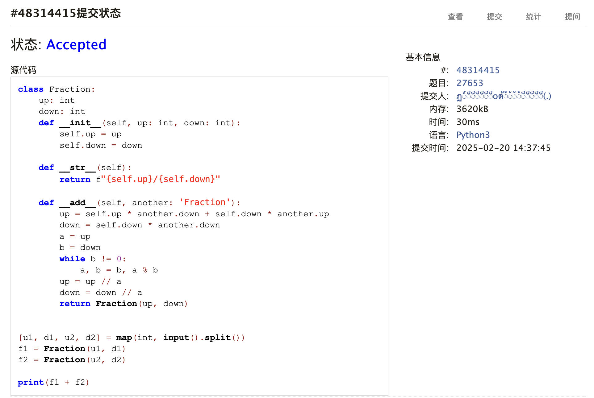
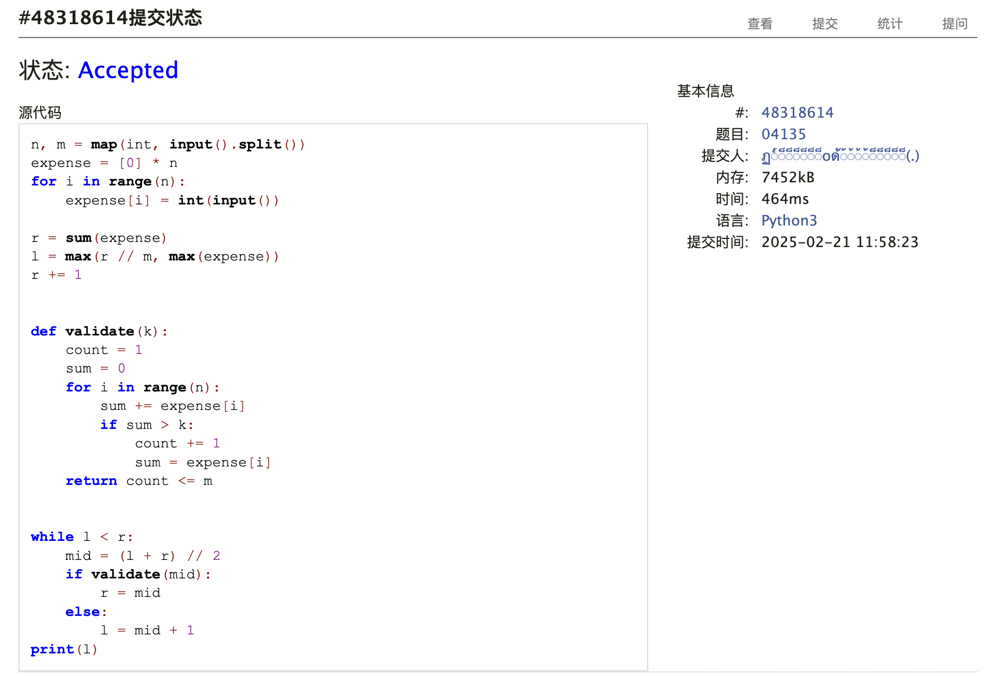
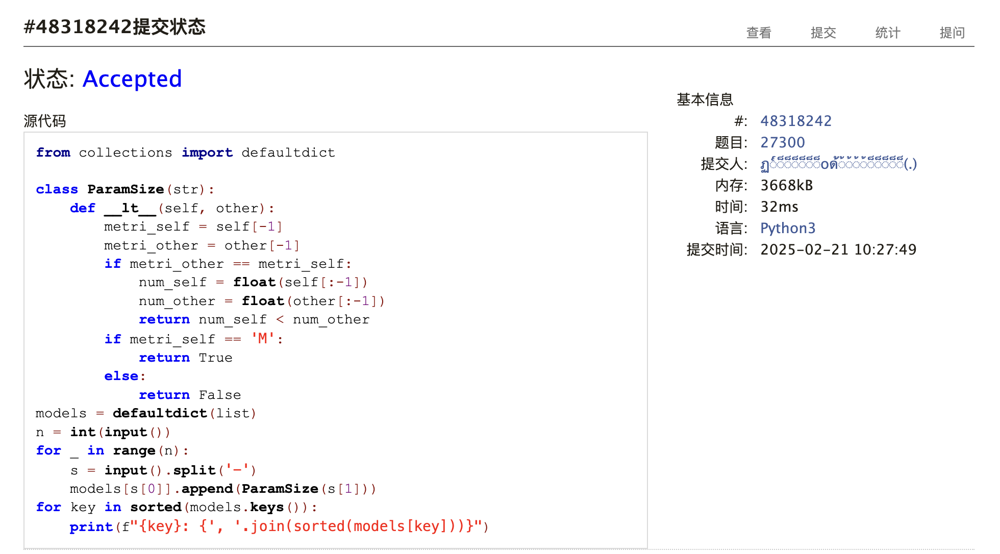

# Assignment #1: 虚拟机，Shell & 大模型


## 1. 题目

### [27653: Fraction 类](http://cs101.openjudge.cn/practice/27653/)

#### 思路

通分，欧几里得算法算最大公约数。

#### 代码

```python
class Fraction:
    up: int
    down: int
    def __init__(self, up: int, down: int):
        self.up = up
        self.down = down

    def __str__(self):
        return f"{self.up}/{self.down}"

    def __add__(self, another: 'Fraction'):
        up = self.up * another.down + self.down * another.up
        down = self.down * another.down
        a = up
        b = down
        while b != 0:
            a, b = b, a % b
        up = up // a
        down = down // a
        return Fraction(up, down)


[u1, d1, u2, d2] = map(int, input().split())
f1 = Fraction(u1, d1)
f2 = Fraction(u2, d2)

print(f1 + f2)
```

#### 代码运行截图



### [1760.袋子里最少数目的球](https://leetcode.cn/problems/minimum-limit-of-balls-in-a-bag/)

#### 思路

试图对二分的范围进行预处理，但是效果并不好。

#### 代码

```python
from typing import List


class Solution:
    def minimumSize(self, nums: List[int], maxOperations: int) -> int:
        def validate(k):
            return sum((num - 1) // k for num in nums) <= maxOperations

        r = max(nums)
        l = 1
        # for num in nums:
        #     r = max(r, num)
        #     l += num
        # l //= len(nums) + maxOperations
        # l = max(l, 1)
        # r += 1
        while l < r:
            mid = (l + r) // 2
            if validate(mid):
                r = mid
            else:
                l = mid + 1
        return l
```

#### 代码运行截图


### [04135: 月度开销](http://cs101.openjudge.cn/practice/04135/)

#### 思路

#### 代码

```python
n, m = map(int, input().split())
expense = [0] * n
for i in range(n):
    expense[i] = int(input())

r = sum(expense)
l = max(r // m, max(expense))
r += 1


def validate(k):
    count = 1
    sum = 0
    for i in range(n):
        sum += expense[i]
        if sum > k:
            count += 1
            sum = expense[i]
    return count <= m


while l < r:
    mid = (l + r) // 2
    if validate(mid):
        r = mid
    else:
        l = mid + 1
print(l)
```

#### 代码运行截图



### [27300: 模型整理](http://cs101.openjudge.cn/practice/27300/)

#### 思路

定义一个 `ParamSize` 类，继承 `str`，专门用于定义模型大小的排序。

#### 代码

```python
from collections import defaultdict

class ParamSize(str):
    def __lt__(self, other):
        metri_self = self[-1]
        metri_other = other[-1]
        if metri_other == metri_self:
            num_self = float(self[:-1])
            num_other = float(other[:-1])
            return num_self < num_other
        if metri_self == 'M':
            return True
        else:
            return False


models = defaultdict(list)
n = int(input())
for _ in range(n):
    s = input().split('-')
    models[s[0]].append(ParamSize(s[1]))
for key in sorted(models.keys()):
    print(f"{key}: {', '.join(sorted(models[key]))}")
```

#### 代码运行截图



### Q5. 大语言模型（LLM）部署与测试

DeepSeek R1 Distill 7B/8B 很难做对题目，生成的代码总会有点小瑕疵，或者是一直不能停止思考。

### Q6. 阅读《Build a Large Language Model (From Scratch)》第一章

#### Understanding LLM

- Usage
  - Text completion
  - Zero-shot (translation etc.)
  - Few-shot (complete tasks with few examples)
- Structure
  - Encoder
  - Decoder
- Common implementations
  - GPT (focuses on decoder, next word prediction)
  - BERT (focuses on encoder, masked word completion)
- Training methodology
  1. Pretrain with unlabelled text, using the next word as a label
  2. Fine-tune
  - Dataset with class labels → classifier
  - Instruction dataset → personal assistant

## 2. 学习总结和个人收获

- 完成了假期选做和 LeetCode 热题 100 中的 80 题，还有一些难题需要研究。
- 接触到了不少计概课上没有或者很少写的算法，例如 KMP/线段树/BIT，但是对节点数不为 $2^n$ 的线段树工作原理还是有些想不通的地方。
- 二分的边界条件有的时候还是不是很清楚，需要多加练习。
