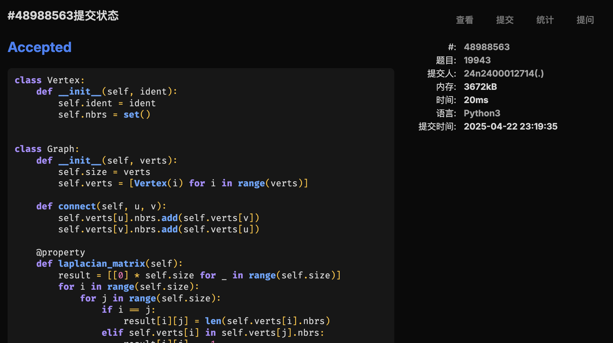
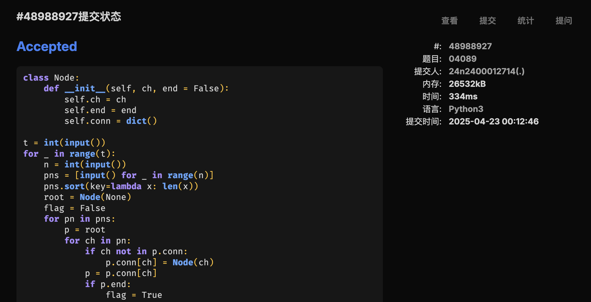
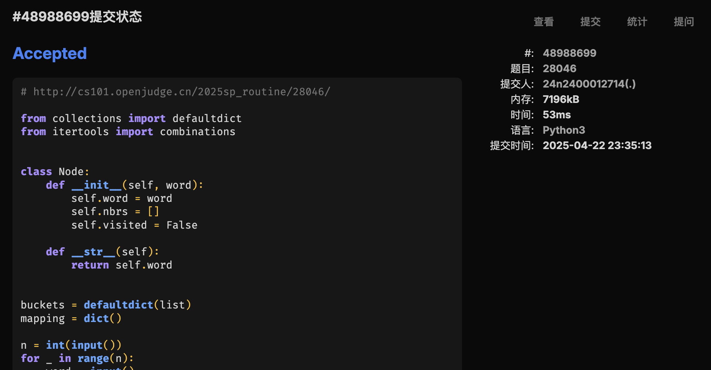

# Assignment #A: Graph starts


## 1. 题目

### [M19943. 图的拉普拉斯矩阵](http://cs101.openjudge.cn/practice/19943/)

要求创建Graph, Vertex两个类，建图实现。

#### 代码

```python
class Vertex:
    def __init__(self, ident):
        self.ident = ident
        self.nbrs = set()


class Graph:
    def __init__(self, verts):
        self.size = verts
        self.verts = [Vertex(i) for i in range(verts)]

    def connect(self, u, v):
        self.verts[u].nbrs.add(self.verts[v])
        self.verts[v].nbrs.add(self.verts[u])

    @property
    def laplacian_matrix(self):
        result = [[0] * self.size for _ in range(self.size)]
        for i in range(self.size):
            for j in range(self.size):
                if i == j:
                    result[i][j] = len(self.verts[i].nbrs)
                elif self.verts[i] in self.verts[j].nbrs:
                    result[i][j] = -1
        return result


n, m = map(int, input().split())
graph = Graph(n)
for _ in range(m):
    u, v = map(int, input().split())
    graph.connect(u, v)

for row in graph.laplacian_matrix:
    print(*row)
```

#### 代码运行截图



### [LC78. 子集](https://leetcode.cn/problems/subsets/)

#### 代码

```python
from typing import List

class Solution:
    def helper(self, nums: List[int], l: int, length: int) -> List[List[int]]:
        if l == length: return [[]]
        mid = 1 << length - l - 1
        sub = self.helper(nums, l + 1, length)
        for i in range(mid):
            temp = sub[i].copy()
            temp.append(nums[l])
            sub.append(temp)
        return sub

    def subsets(self, nums: List[int]) -> List[List[int]]:
        return self.helper(nums, 0, len(nums))
```

#### 代码运行截图


### [LC17. 电话号码的字母组合](https://leetcode.cn/problems/letter-combinations-of-a-phone-number/)

#### 代码

```python
from typing import List


class Solution:
    table = {
        "2": "abc",
        "3": "def",
        "4": "ghi",
        "5": "jkl",
        "6": "mno",
        "7": "pqrs",
        "8": "tuv",
        "9": "wxyz",
    }

    def helper(self, digits: str, l: int, length: int, current: List[str]) -> List[str]:
        if l == length:
            return current
        now = []
        for x in current:
            for ch in self.table[digits[l]]:
                now.append(x + ch)
        return self.helper(digits, l + 1, length, now)

    def letterCombinations(self, digits: str) -> List[str]:
        if not digits:
            return []
        return self.helper(digits, 0, len(digits), [""])
```

#### 代码运行截图


### [M04089. 电话号码](http://cs101.openjudge.cn/practice/04089/)

#### 代码

```python
class Node:
    def __init__(self, ch, end = False):
        self.ch = ch
        self.end = end
        self.conn = dict()

t = int(input())
for _ in range(t):
    n = int(input())
    pns = [input() for _ in range(n)]
    # so that we only need to verify former ones are not
    # prefix of latter ones.
    pns.sort(key=lambda x: len(x))
    root = Node(None)
    flag = False
    for pn in pns:
        p = root
        for ch in pn:
            if ch not in p.conn:
                p.conn[ch] = Node(ch)
            p = p.conn[ch]
            if p.end:
                flag = True
                break
        if flag:
            break
        p.end = True
    print("NO" if flag else "YES")
```

#### 代码运行截图



### [T28046. 词梯](http://cs101.openjudge.cn/practice/28046/)

#### 思路

`itertools.combinations()` 很好用

#### 代码

```python
from collections import defaultdict
from itertools import combinations


class Node:
    def __init__(self, word):
        self.word = word
        self.nbrs = []
        self.visited = False

    def __str__(self):
        return self.word


buckets = defaultdict(list)
mapping = dict()

n = int(input())
for _ in range(n):
    word = input()
    node = Node(word)
    mapping[word] = node
    for i in range(4):
        placeholder = word[:i] + "_" + word[i + 1 :]
        buckets[placeholder].append(node)

for bucket in buckets.values():
    for u, v in combinations(bucket, 2):
        u.nbrs.append(v)
        v.nbrs.append(u)

src, dst = map(mapping.get, input().split())

current_level = [[src]]
while current_level:
    next_level = []
    for route in current_level:
        pos = route[-1]
        if pos == dst:
            print(*route)
            exit(0)
        for nbr in pos.nbrs:
            if nbr.visited:
                continue
            nbr.visited = True
            next_level.append(route + [nbr])
    current_level = next_level

print("NO")
```

#### 代码运行截图



### [T51. N皇后](https://leetcode.cn/problems/n-queens/)

#### 代码

```python
from typing import List


class Solution:
    def is_legal(self, occupied: List[int], row, pos):
        for i in range(row):
            if (
                occupied[i] == pos
                or occupied[i] - i + row == pos
                or occupied[i] - row + i == pos
            ):
                return False
        return True

    def search(self, row: int, occupied: List[int], n: int) -> List[List[int]]:
        if row == n:
            return [occupied.copy()]
        occupied.append(0)
        result = []
        for i in range(n):
            if self.is_legal(occupied, row, i):
                occupied[-1] = i
                result += self.search(row + 1, occupied, n)
        occupied.pop()
        return result

    def create_str(self, occupied: List[int]) -> List[str]:
        n = len(occupied)
        result = []
        for i in range(n):
            result.append("." * occupied[i] + "Q" + "." * (n - occupied[i] - 1))
        return result

    def solveNQueens(self, n: int) -> List[List[str]]:
        possibilities = self.search(0, [], n)
        return [self.create_str(x) for x in possibilities]
```

#### 代码运行截图


## 2. 学习总结和收获

上周末各种事情叠在一起，下周二电磁要期中了，准备五一补做力扣周赛。
