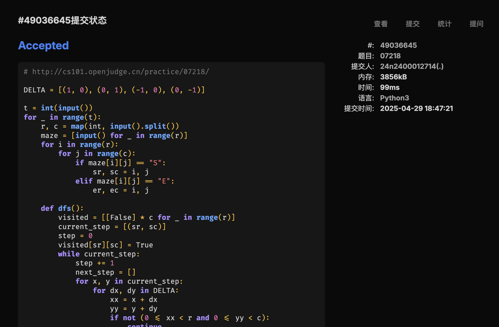
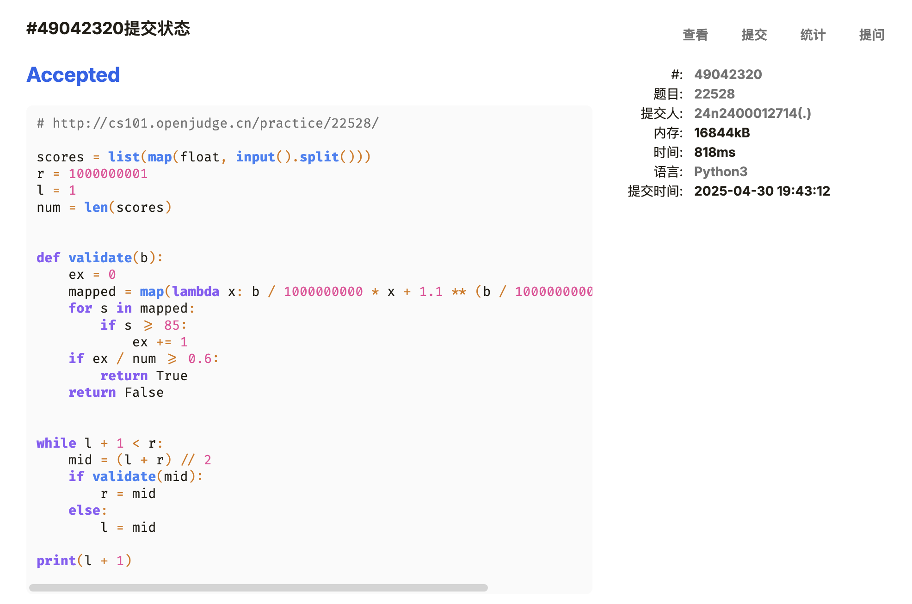
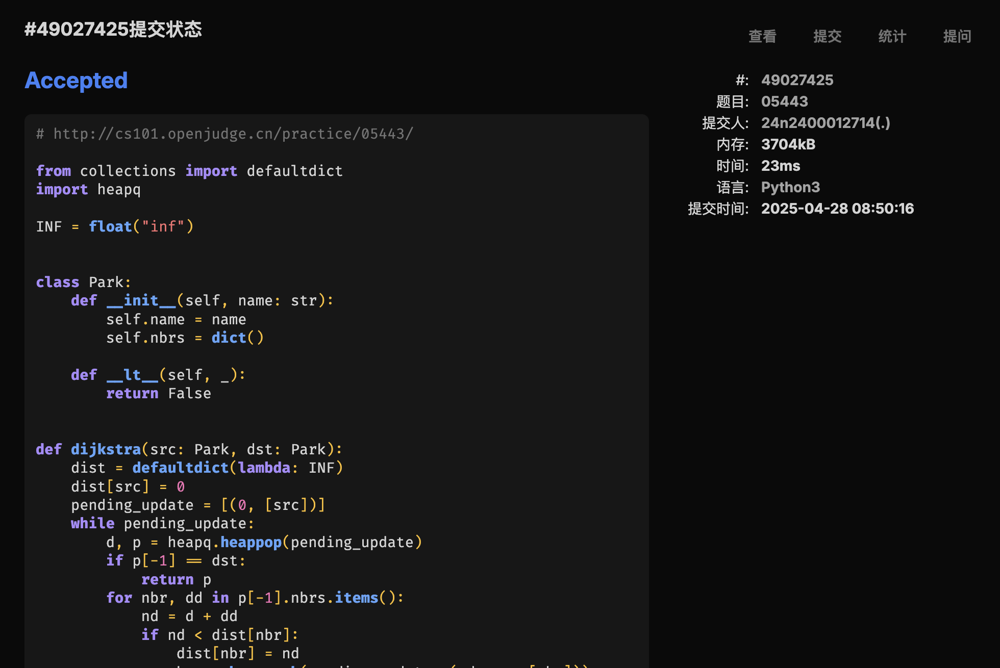
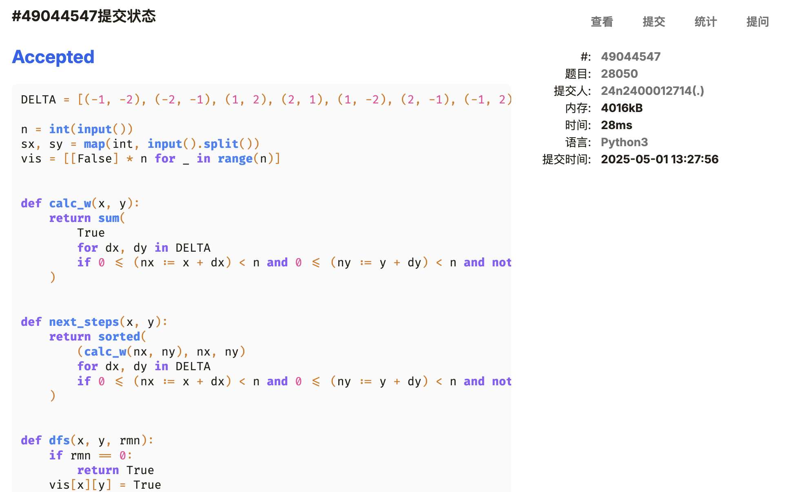

# Assignment #B: 图为主


## 1. 题目

### [E07218. 献给阿尔吉侬的花束](http://cs101.openjudge.cn/practice/07218/)

<Tag>BFS</Tag>

#### 代码

```python
DELTA = [(1, 0), (0, 1), (-1, 0), (0, -1)]

t = int(input())
for _ in range(t):
    r, c = map(int, input().split())
    maze = [input() for _ in range(r)]
    for i in range(r):
        for j in range(c):
            if maze[i][j] == "S":
                sr, sc = i, j
            elif maze[i][j] == "E":
                er, ec = i, j

    def dfs():
        visited = [[False] * c for _ in range(r)]
        current_step = [(sr, sc)]
        step = 0
        visited[sr][sc] = True
        while current_step:
            step += 1
            next_step = []
            for x, y in current_step:
                for dx, dy in DELTA:
                    xx = x + dx
                    yy = y + dy
                    if not (0 <= xx < r and 0 <= yy < c):
                        continue
                    if maze[xx][yy] == '#':
                        continue
                    if (xx, yy) == (er, ec):
                        return step
                    if visited[xx][yy]:
                        continue
                    visited[xx][yy] = True
                    next_step.append((xx, yy))
            current_step = next_step
        return None

    print(s if (s := dfs()) is not None else "oop!")
```

#### 代码运行截图



### [M3532. 针对图的路径存在性查询I](https://leetcode.cn/problems/path-existence-queries-in-a-graph-i/)

<Tag>Disjoint Set</Tag>

#### 代码

```python
from typing import List


class Solution:
    def pathExistenceQueries(
        self, n: int, nums: List[int], maxDiff: int, queries: List[List[int]]
    ) -> List[bool]:
        bp = []
        for i in range(len(nums) - 1):
            if nums[i + 1] - nums[i] > maxDiff:
                bp.append(i)
        bpp = 0
        ans = [False] * len(queries)
        nq = list(map(lambda x: ([min(x[1]), max(x[1])], x[0]), enumerate(queries)))
        nq.sort()
        for q, i in nq:
            while bpp < len(bp) and bp[bpp] < q[0]:
                bpp += 1
            ans[i] = (bpp >= len(bp) or bp[bpp] >= q[1])
        return ans
```

#### 代码运行截图


### [M22528. 厚道的调分方法](http://cs101.openjudge.cn/practice/22528/)

<Tag>Binary Search</Tag>

#### 代码

```python
scores = list(map(float, input().split()))
r = 1000000001
l = 1
num = len(scores)


def validate(b):
    ex = 0
    mapped = map(lambda x: b / 1000000000 * x + 1.1 ** (b / 1000000000 * x), scores)
    for s in mapped:
        if s >= 85:
            ex += 1
    if ex / num >= 0.6:
        return True
    return False


while l + 1 < r:
    mid = (l + r) // 2
    if validate(mid):
        r = mid
    else:
        l = mid

print(l + 1)
```

#### 代码运行截图



### [Msy382. 有向图判环](https://sunnywhy.com/sfbj/10/3/382)

<Tag>DFS</Tag>

#### 思路

#### 代码

```python
from typing import Set

class Vertex:
    def __init__(self):
        self.to = []
        self.visited = False

n, m = map(int, input().split())
vertices = [Vertex() for _ in range(n)]
for _ in range(m):
    u, v = map(lambda x: vertices[int(x)], input().split())
    u.to.append(v)

def visit(vert, route: Set):
    if vert in route:
        return True
    route.add(vert)
    for v in vert.to:
        if not v.visited and visit(v, route.copy()):
            return True
    vert.visited = True
    return False

for v in vertices:
    if not v.visited and visit(v, set()):
        print("Yes")
        break
else:
    print("No")
```

#### 代码运行截图


### [M05443. 兔子与樱花](http://cs101.openjudge.cn/practice/05443/)

<Tag>Dijkstra</Tag>

#### 代码

```python
from collections import defaultdict
import heapq

INF = float("inf")


class Park:
    def __init__(self, name: str):
        self.name = name
        self.nbrs = dict()

    def __lt__(self, _):
        return False


def dijkstra(src: Park, dst: Park):
    dist = defaultdict(lambda: INF)
    dist[src] = 0
    pending_update = [(0, [src])]
    while pending_update:
        d, p = heapq.heappop(pending_update)
        if p[-1] == dst:
            return p
        for nbr, dd in p[-1].nbrs.items():
            nd = d + dd
            if nd < dist[nbr]:
                dist[nbr] = nd
                heapq.heappush(pending_update, (nd, p + [nbr]))
    return None


p = int(input())
parks = dict()
for _ in range(p):
    name = input()
    parks[name] = Park(name)

q = int(input())
for _ in range(q):
    u, v, s = input().split()
    parks[u].nbrs[parks[v]] = int(s)
    parks[v].nbrs[parks[u]] = int(s)

r = int(input())
for _ in range(r):
    src, dst = map(parks.get, input().split())
    if not (route := dijkstra(src, dst)):
        raise NotImplementedError()
    print(route[0].name, end="")
    for i in range(1, len(route)):
        print(f"->({route[i - 1].nbrs[route[i]]})->{route[i].name}", end="")
    print()
```

#### 代码运行截图



### [T28050. 骑士周游](http://cs101.openjudge.cn/practice/28050/)

<Tag>DFS</Tag>

#### 思路

我已逐渐理解 generator expression.

#### 代码

```python
DELTA = [(-1, -2), (-2, -1), (1, 2), (2, 1), (1, -2), (2, -1), (-1, 2), (-2, 1)]

n = int(input())
sx, sy = map(int, input().split())
vis = [[False] * n for _ in range(n)]


def calc_w(x, y):
    return sum(
        True
        for dx, dy in DELTA
        if 0 <= (nx := x + dx) < n and 0 <= (ny := y + dy) < n and not vis[nx][ny]
    )


def next_steps(x, y):
    return sorted(
        (calc_w(nx, ny), nx, ny)
        for dx, dy in DELTA
        if 0 <= (nx := x + dx) < n and 0 <= (ny := y + dy) < n and not vis[nx][ny]
    )


def dfs(x, y, rmn):
    if rmn == 0:
        return True
    vis[x][y] = True
    for _, nx, ny in next_steps(x, y):
        if dfs(nx, ny, rmn - 1):
            return True
    vis[x][y] = False
    return False


print("success" if dfs(sx, sy, n**2 - 1) else "fail")
```

#### 代码运行截图


## 2. 学习总结和收获

上周周赛 AC 2，困难题拼尽全力无法战胜。

为什么他们的调分方法能跑那么快？