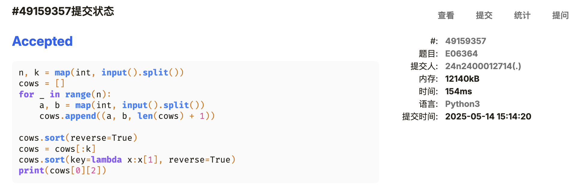
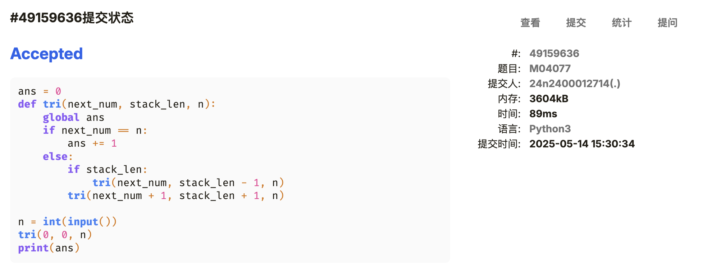
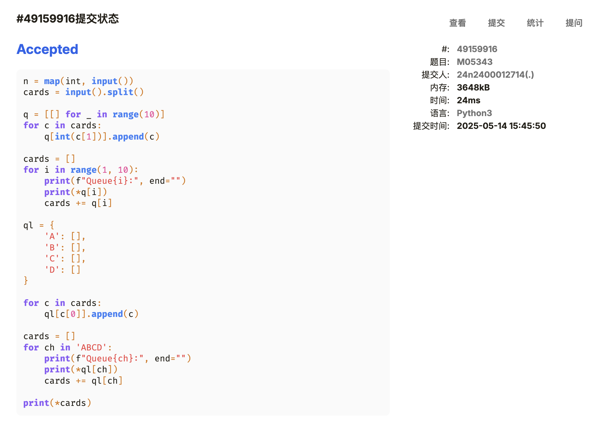
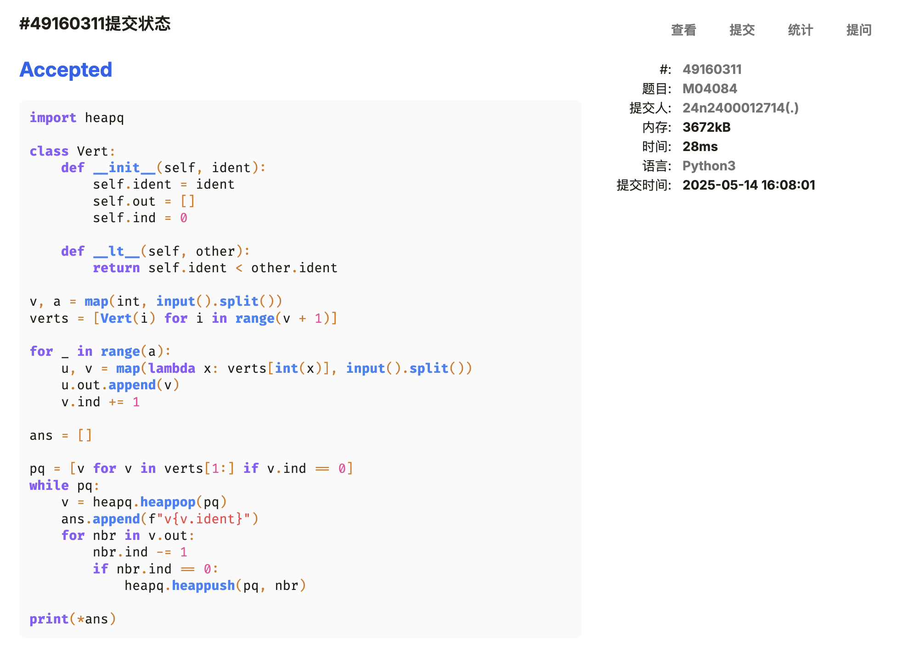
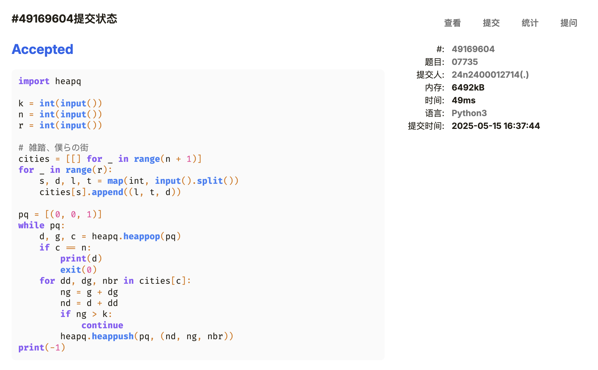
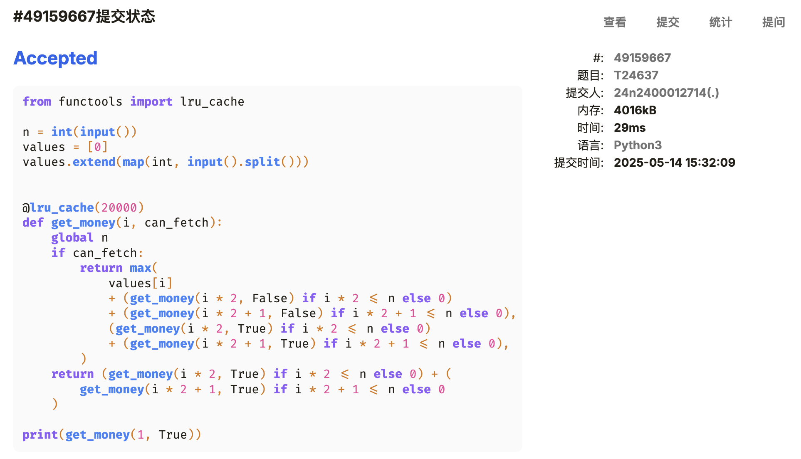

# Assignment #C: 202505114 Mock Exam


## 1. 题目

### [E06364. 牛的选举](http://cs101.openjudge.cn/practice/06364/)

#### 代码

```python
n, k = map(int, input().split())
cows = []
for _ in range(n):
    a, b = map(int, input().split())
    cows.append((a, b, len(cows) + 1))

cows.sort(reverse=True)
cows = cows[:k]
cows.sort(key=lambda x:x[1], reverse=True)
print(cows[0][2])
```

#### 代码运行截图



### [M04077. 出栈序列统计](http://cs101.openjudge.cn/practice/04077/)

#### 代码

```python
ans = 0
def tri(next_num, stack_len, n):
    global ans
    if next_num == n:
        ans += 1
    else:
        if stack_len:
            tri(next_num, stack_len - 1, n)
        tri(next_num + 1, stack_len + 1, n)

n = int(input())
tri(0, 0, n)
print(ans)
```

#### 代码运行截图



### [M05343. 用队列对扑克牌排序](http://cs101.openjudge.cn/practice/05343/)

#### 思路

不用队列😋

#### 代码

```python
n = map(int, input())
cards = input().split()

q = [[] for _ in range(10)]
for c in cards:
    q[int(c[1])].append(c)

cards = []
for i in range(1, 10):
    print(f"Queue{i}:", end="")
    print(*q[i])
    cards += q[i]

ql = {
    'A': [],
    'B': [],
    'C': [],
    'D': []
}

for c in cards:
    ql[c[0]].append(c)

cards = []
for ch in 'ABCD':
    print(f"Queue{ch}:", end="")
    print(*ql[ch])
    cards += ql[ch]

print(*cards)
```

#### 代码运行截图



### [M04084. 拓扑排序](http://cs101.openjudge.cn/practice/04084/)

#### 思路

这个题目歧义也太大了。

“同等条件下” 这个条件理解方法有很多种。

#### 代码

```python
import heapq

class Vert:
    def __init__(self, ident):
        self.ident = ident
        self.out = []
        self.ind = 0

    def __lt__(self, other):
        return self.ident < other.ident

v, a = map(int, input().split())
verts = [Vert(i) for i in range(v + 1)]

for _ in range(a):
    u, v = map(lambda x: verts[int(x)], input().split())
    u.out.append(v)
    v.ind += 1

ans = []

pq = [v for v in verts[1:] if v.ind == 0]
while pq:
    v = heapq.heappop(pq)
    ans.append(f"v{v.ident}")
    for nbr in v.out:
        nbr.ind -= 1
        if nbr.ind == 0:
            heapq.heappush(pq, nbr)

print(*ans)
```

**附上我对 “相同条件下” 的另外两种理解方法**

这种能过样例但是喜获 WA

```python
class Vert:
    def __init__(self, ident):
        self.ident = ident
        self.out = []
        self.ind = 0
        self.sorted = False

    def __lt__(self, other):
        return self.ident < other.ident

    def __str__(self):
        return f"v{self.ident}"

v, a = map(int, input().split())
verts = [Vert(i) for i in range(v + 1)]

for _ in range(a):
    u, v = map(lambda x: verts[int(x)], input().split())
    u.out.append(v)
    v.ind += 1

for v in verts:
    v.out.sort()

ans = []
def sort(vert):
    vert.sorted = True
    ans.append(vert)
    for v in vert.out:
        v.ind -= 1
        if v.ind == 0:
            sort(v)

for v in verts[1:]:
    if v.ind == 0 and not v.sorted:
        sort(v)

print(*map(str, ans))
```

这种连样例都过不了

```python
from itertools import chain


class Vert:
    def __init__(self, ident):
        self.ident = ident
        self.out = []
        self.ind = 0

    def __lt__(self, other):
        return self.ident < other.ident

    def __repr__(self):
        return f"v{self.ident}"


v, a = map(int, input().split())
verts = [Vert(i) for i in range(v + 1)]

for _ in range(a):
    u, v = map(lambda x: verts[int(x)], input().split())
    u.out.append(v)
    v.ind += 1

sort_result = [[v for v in verts[1:] if v.ind == 0]]
while sort_result[-1]:
    last_sorted = sort_result[-1]
    sort_result.append([])
    for v in last_sorted:
        for nbr in v.out:
            nbr.ind -= 1
            if nbr.ind == 0:
                sort_result[-1].append(nbr)

print(*chain(*map(sorted, sort_result)))
```

#### 代码运行截图



### [M07735. 道路](http://cs101.openjudge.cn/practice/07735/)

<Tag>Dijkstra</Tag>

#### 代码

DeepSeek 给出的想法，我的实现：

```python
#pylint:skip-file
import heapq
from collections import defaultdict

INF = float("INF")

class City:
    def __init__(self):
        self.to = []
        self.visited = False
        self.dist = defaultdict(lambda: INF)

    def __lt__(self, other):
        return False

k = int(input())
n = int(input())
r = int(input())

cities = [City() for _ in range(n + 1)]
for _ in range(r):
    s, d, l, t = map(int, input().split())
    cities[s].to.append((l, t, cities[d]))

src = cities[1]
dst = cities[n]

pq = [(0, 0, src)]
src.dist[0] = 0
while pq:
    d, g, c = heapq.heappop(pq)
    if c == dst:
        break
    for dd, dg, nbr in c.to:
        ng = g + dg
        nd = d + dd
        if ng > k:
            continue
        if nd < nbr.dist[ng]:
            nbr.dist[ng] = nd
            heapq.heappush(pq, (nd, ng, nbr))
print(v if (v:=min(dst.dist.values())) != INF else -1)
```

然而事实上，`City.dist` 这个词典增添条目的次数远大于进行比较的次数，也就是根本剪枝剪不掉几次，所以其实直接去掉这个属性也无妨。

以下这段代码仍然可以通过

```python
import heapq

# 雑踏、僕らの街
class City:
    def __init__(self):
        self.to = []

    def __lt__(self, other):
        return False


k = int(input())
n = int(input())
r = int(input())

cities = [City() for _ in range(n + 1)]
for _ in range(r):
    s, d, l, t = map(int, input().split())
    cities[s].to.append((l, t, cities[d]))

src = cities[1]
dst = cities[n]

pq = [(0, 0, src)]
while pq:
    d, g, c = heapq.heappop(pq)
    if c == dst:
        print(d)
        exit(0)
    for dd, dg, nbr in c.to:
        ng = g + dg
        nd = d + dd
        if ng > k:
            continue
        heapq.heappush(pq, (nd, ng, nbr))
print(-1)
```

诶都这样了我们直接干掉那个类得了

```python
import heapq

k = int(input())
n = int(input())
r = int(input())

# 雑踏、僕らの街
cities = [[] for _ in range(n + 1)]
for _ in range(r):
    s, d, l, t = map(int, input().split())
    cities[s].append((l, t, d))

pq = [(0, 0, 1)]
while pq:
    d, g, c = heapq.heappop(pq)
    if c == n:
        print(d)
        exit(0)
    for dd, dg, nbr in cities[c]:
        ng = g + dg
        nd = d + dd
        if ng > k:
            continue
        heapq.heappush(pq, (nd, ng, nbr))
print(-1)
```

还有这道题目的测试数据漏掉了无解的情况，注释掉 `print(-1)` 仍然可以通过。

#### 代码运行截图



### [T24637. 宝藏二叉树](http://cs101.openjudge.cn/practice/24637/)

<Tag>DP</Tag>

#### 思路

> `lru_cache` 我们喜欢你呀。

#### 代码

```python
from functools import lru_cache

n = int(input())
values = [0]
values.extend(map(int, input().split()))


@lru_cache(20000)
def get_money(i, can_fetch):
    global n
    if can_fetch:
        return max(
            values[i]
            + (get_money(i * 2, False) if i * 2 <= n else 0)
            + (get_money(i * 2 + 1, False) if i * 2 + 1 <= n else 0),
            (get_money(i * 2, True) if i * 2 <= n else 0)
            + (get_money(i * 2 + 1, True) if i * 2 + 1 <= n else 0),
        )
    return (get_money(i * 2, True) if i * 2 <= n else 0) + (
        get_money(i * 2 + 1, True) if i * 2 + 1 <= n else 0
    )

print(get_money(1, True))
```

#### 代码运行截图



## 2. 学习总结和收获

考场上真的自己做出来的其实只有四道，没做出来的是拓扑排序和道路，不过问过 AI 之后也很快写出来了。拓扑排序那个题目过于奇妙，不好说是知识点不会导致的，但是道路确实是因为对 Dijkstra 的理解不够深刻。