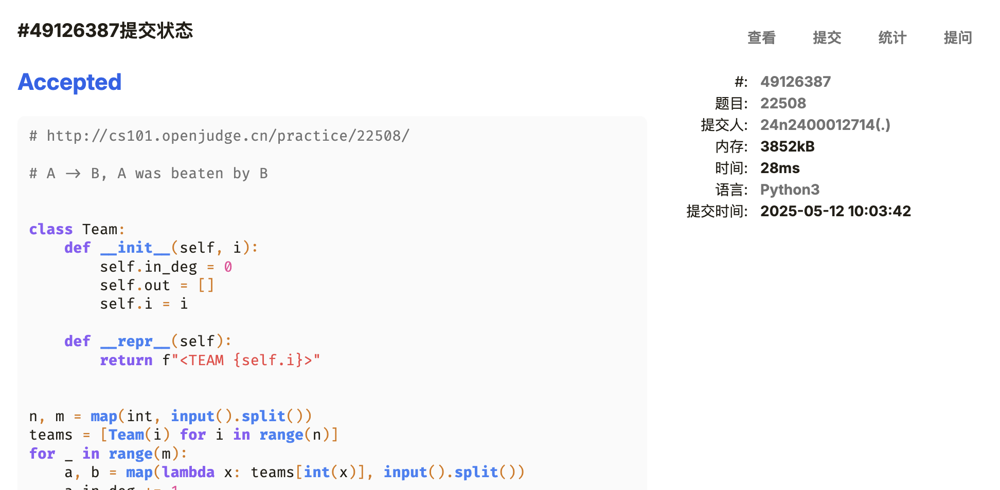

# Assignment #D: 图 & 散列表


## 1. 题目

### [M17975. 用二次探查法建立散列表](http://cs101.openjudge.cn/practice/17975/)

#### 思路

输入太坑了😭

顺便试了试自己实现一个迭代器

#### 代码

```python
class DeltaGenerator:
    def __init__(self):
        self.num = 0
        self.multiplier = -1

    def __iter__(self):
        return self

    def __next__(self):
        val = self.num**2 * self.multiplier
        self.num += (self.multiplier - 1) // -2
        self.multiplier *= -1
        return val

    def reset(self):
        self.__init__()


n, k = map(int, input().split())
nums = []
while len(nums) < n:
    nums.extend(map(int, input().split()))
hashmap = [None] * k
generator = DeltaGenerator()
positions = []

for num in nums:
    generator.reset()
    pos = -1
    for delta in generator:
        pos = (num + delta) % k
        if hashmap[pos] is None or hashmap[pos] == num:
            break
    hashmap[pos] = num
    positions.append(pos)

print(*positions)
```

#### 代码运行截图


### [M01258. Agri-Net](http://cs101.openjudge.cn/practice/01258/)

<Tag>MST</Tag>

#### 思路

#### 代码

```python
import heapq

while True:
    try:
        n = int(input())
    except EOFError:
        break
    connectivity = [list(map(int, input().split())) for _ in range(n)]
    connected = [False] * n
    total_dist = 0
    connected[0] = True
    connected_cnt = 1
    pending_edges = [(connectivity[0][i], i) for i in range(1, n)]

    heapq.heapify(pending_edges)

    while connected_cnt < n:
        d, t = heapq.heappop(pending_edges)
        while connected[t]:
            d, t = heapq.heappop(pending_edges)
        total_dist += d
        connected[t] = True
        connected_cnt += 1
        for i in range(n):
            if connected[i]:
                continue
            heapq.heappush(pending_edges, (connectivity[t][i], i))

    print(total_dist)
```

#### 代码运行截图


### [M3552. 网络传送门旅游](https://leetcode.cn/problems/grid-teleportation-traversal/)

<Tag>bfs</Tag>

#### 思路

第一次遇到记录了 visited 还会超时的

本质是即使记录了 visited，仍然会产生一次计算，剪枝仍然不够彻底

#### 代码

```python
# https://leetcode.cn/problems/grid-teleportation-traversal/description/

from typing import List
from collections import defaultdict

DELTA = [(-1, 0), (1, 0), (0, -1), (0, 1)]


class Solution:
    def minMoves(self, matrix: List[str]) -> int:
        if matrix[-1][-1] == "#":
            return -1
        m = len(matrix)
        n = len(matrix[0])
        if m == 1 and n == 1:
            return 0
        portals = defaultdict(list)

        for i, row in enumerate(matrix):
            for j, ch in enumerate(row):
                if ch in ".#":
                    continue
                portals[ch].append((i, j))
        steps = 0
        pending = [(0, 0)]
        visited = [[False] * n for _ in range(m)]
        visited[0][0] = True
        if matrix[0][0] != ".":
            for px, py in portals[matrix[0][0]]:
                if (px, py) == (m - 1, n - 1):
                    return 0
                pending.append((px, py))
                visited[px][py] = True
        while pending:
            steps += 1
            next_step = []
            for x, y in pending:
                for dx, dy in DELTA:
                    xx = x + dx
                    yy = y + dy
                    if (
                        not (0 <= xx < m and 0 <= yy < n)
                        or visited[xx][yy]
                        or matrix[xx][yy] == "#"
                    ):
                        continue
                    if (xx, yy) == (m - 1, n - 1):
                        return steps
                    visited[xx][yy] = True
                    next_step.append((xx, yy))
                    if matrix[xx][yy] != ".":
                        for px, py in portals[matrix[xx][yy]]:
                            if (px, py) == (m - 1, n - 1):
                                return steps
                            next_step.append((px, py))
                        # IMPORTANT!: this avoids repetitive portal uses
                        # and eliminates the time spent on iterating through
                        # exits.
                        del portals[matrix[xx][yy]]
            pending = next_step
        return -1
```

#### 代码运行截图


### [M787. K 站中转内最便宜的航班](https://leetcode.cn/problems/cheapest-flights-within-k-stops/)

<Tag>Bellman-Ford</Tag>

#### 思路

Bellman-Ford 居然比 Dijkstra 快一点

不过也可能是 Dijkstra 使用了类导致的

#### 代码

**Bellman-Ford**

```python
from typing import List

INF = float('inf')

class Solution:
    def findCheapestPrice(
        self, n: int, flights: List[List[int]], src: int, dst: int, k: int
    ) -> int:
        cities = [[] for _ in range(n)]
        for f, t, p in flights:
            cities[f].append((t, p))

        price = [INF] * n
        price[src] = 0
        for _ in range(k + 1):
            # if price[f] was updated during this iteration
            # updating price[p] based on the updated price[f]
            # can make stops > k
            price_cache = price.copy()
            for f, t, p in flights:
                if price[t] > price_cache[f] + p:
                    price[t] = price_cache[f] + p
        return price[dst] if price[dst] != INF else -1
```

**Dijkstra**

```python
from typing import List
from collections import defaultdict
import heapq

INF = float("inf")


class City:
    def __init__(self):
        self.to = []
        self.prices = defaultdict(lambda: INF)

    def __lt__(self, _):
        return False


class Solution:
    def findCheapestPrice(
        self, n: int, flights: List[List[int]], src: int, dst: int, k: int
    ) -> int:
        cities = [City() for _ in range(n)]
        src_city = cities[src]
        dst_city = cities[dst]
        for fro, to, price in flights:
            cities[fro].to.append((cities[to], price))
        pq = [(0, 0, src_city)]
        while pq:
            price, stops, city = heapq.heappop(pq)
            if city == dst_city:
                return price
            stops += 1
            for nbr, dprice in city.to:
                if nbr != dst_city and stops > k:
                    continue
                nprice = price + dprice
                if nbr.prices[stops] > nprice:
                    nbr.prices[stops] = nprice
                    heapq.heappush(pq, (nprice, stops, nbr))
        return -1
```

#### 代码运行截图


### [M03424. Candies](http://cs101.openjudge.cn/practice/03424/)

<Tag>Dijkstra</Tag>

#### 思路

天呐居然是 Dijkstra

#### 代码

```python
import heapq

INF = float('inf')
n, m = map(int, input().split())
kids = [[] for _ in range(n + 1)]
for _ in range(m):
    a, b, c = map(int, input().split())
    kids[a].append((b, c))

dist = [INF] * (n + 1)
dist[1] = 0
pq = [(0, 1)]

while pq:
    d, t = heapq.heappop(pq)
    if t == n:
        print(d)
        break
    for nbr, dd in kids[t]:
        nd = d + dd
        if nd < dist[nbr]:
            dist[nbr] = nd
            heapq.heappush(pq, (nd, nbr))
```

#### 代码运行截图


### [M22508. 最小奖金方案](http://cs101.openjudge.cn/practice/22508/)

<Tag>topological order</Tag>

#### 代码

```python
# A -> B, A was beaten by B


class Team:
    def __init__(self, i):
        self.in_deg = 0
        self.out = []
        self.i = i

    def __repr__(self):
        return f"<TEAM {self.i}>"


n, m = map(int, input().split())
teams = [Team(i) for i in range(n)]
for _ in range(m):
    a, b = map(lambda x: teams[int(x)], input().split())
    a.in_deg += 1
    b.out.append(a)

sort_result = [[team for team in teams if team.in_deg == 0]]
while sort_result[-1]:
    last_sorted = sort_result[-1]
    sort_result.append([])
    for t in last_sorted:
        for out in t.out:
            out.in_deg -= 1
            if not out.in_deg:
                sort_result[-1].append(out)

print(100 * n + sum(len(level) * i for i, level in enumerate(sort_result)))
```

#### 代码运行截图



## 2. 学习总结和收获

感觉这周作业强度上来了。Candies 和航班中转两道题都不能看到马上写出来，卡了很久。

各门课大作业都压过来了，希望还能找到时间做数算。
