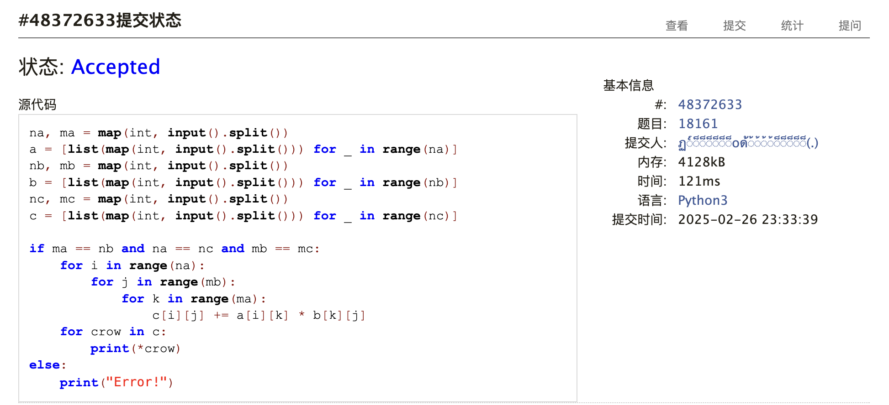
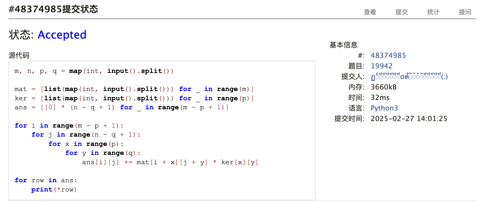
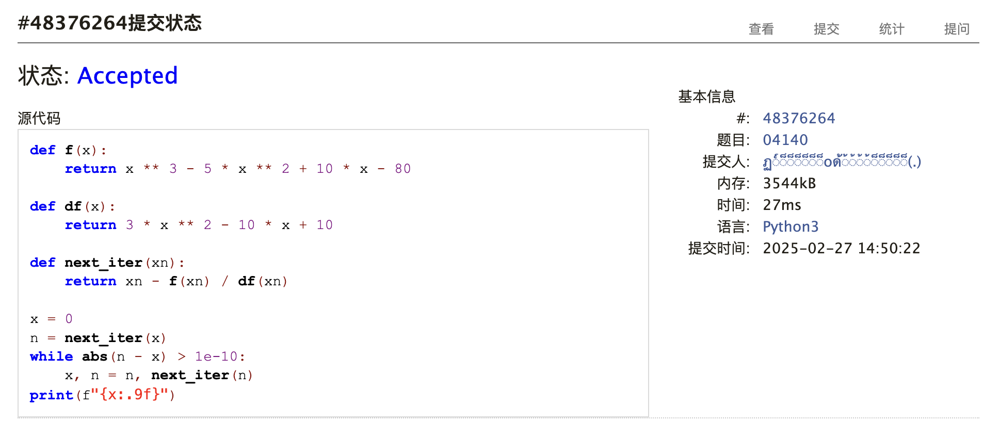
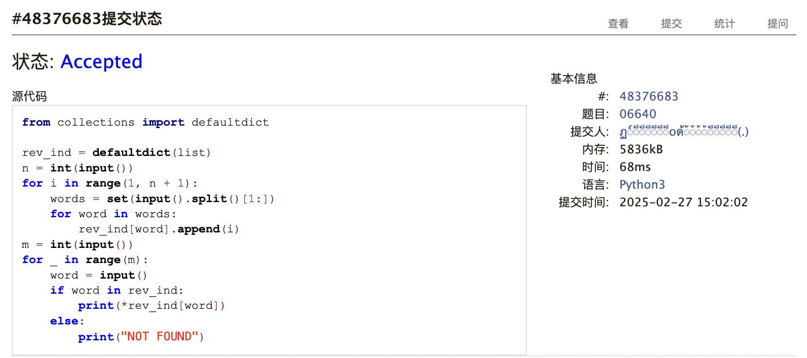
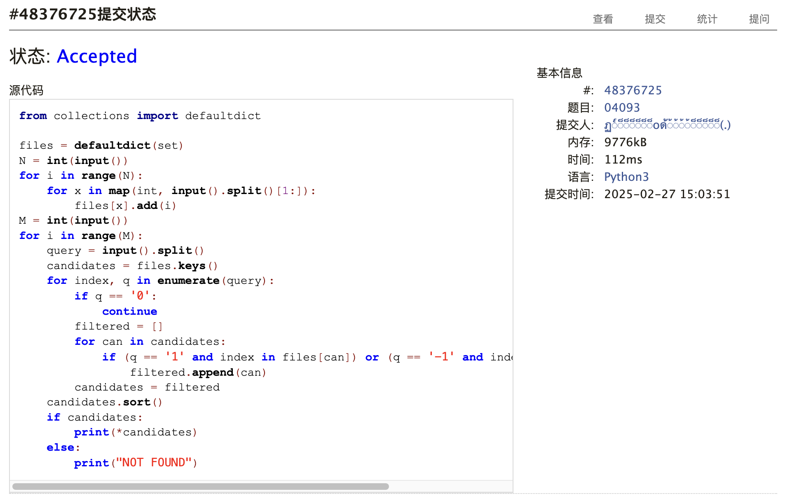

# Assignment #2: 深度学习与大语言模型


## 1. 题目

### [18161: 矩阵运算](http://cs101.openjudge.cn/practice/18161)

#### 代码

```python
na, ma = map(int, input().split())
a = [list(map(int, input().split())) for _ in range(na)]
nb, mb = map(int, input().split())
b = [list(map(int, input().split())) for _ in range(nb)]
nc, mc = map(int, input().split())
c = [list(map(int, input().split())) for _ in range(nc)]

if ma == nb and na == nc and mb == mc:
    for i in range(na):
        for j in range(mb):
            for k in range(ma):
                c[i][j] += a[i][k] * b[k][j]
    for crow in c:
        print(*crow)
else:
    print("Error!")
```

#### 代码运行截图



### [19942: 二维矩阵上的卷积运算](http://cs101.openjudge.cn/practice/19942/)

#### 代码

```python
m, n, p, q = map(int, input().split())

mat = [list(map(int, input().split())) for _ in range(m)]
ker = [list(map(int, input().split())) for _ in range(p)]
ans = [[0] * (n - q + 1) for _ in range(m - p + 1)]

for i in range(m - p + 1):
    for j in range(n - q + 1):
        for x in range(p):
            for y in range(q):
                ans[i][j] += mat[i + x][j + y] * ker[x][y]

for row in ans:
    print(*row)
```

#### 代码运行截图



### [04140: 方程求解](http://cs101.openjudge.cn/practice/04140/)

#### 代码

```python
def f(x):
    return x**3 - 5 * x**2 + 10 * x - 80


def df(x):
    return 3 * x**2 - 10 * x + 10


def next_iter(xn):
    return xn - f(xn) / df(xn)


x = 0
n = next_iter(x)
while abs(n - x) > 1e-10:
    x, n = n, next_iter(n)
print(f"{x:.9f}")
```

#### 代码运行截图



### [06640: 倒排索引](http://cs101.openjudge.cn/practice/06640/)

#### 思路

注意要用 `set` 去重。

#### 代码

```python
from collections import defaultdict

rev_ind = defaultdict(list)
n = int(input())
for i in range(1, n + 1):
    words = set(input().split()[1:])
    for word in words:
        rev_ind[word].append(i)
m = int(input())
for _ in range(m):
    word = input()
    if word in rev_ind:
        print(*rev_ind[word])
    else:
        print("NOT FOUND")
```

#### 代码运行截图



### [04093: 倒排索引查询](http://cs101.openjudge.cn/practice/04093/)

#### 代码

```python
from collections import defaultdict

files = defaultdict(set)
N = int(input())
for i in range(N):
    for x in map(int, input().split()[1:]):
        files[x].add(i)
M = int(input())
for i in range(M):
    query = input().split()
    candidates = files.keys()
    for index, q in enumerate(query):
        if q == '0':
            continue
        filtered = []
        for can in candidates:
            if (q == '1' and index in files[can]) or (q == '-1' and index not in files[can]):
                filtered.append(can)
        candidates = filtered
    candidates.sort()
    if candidates:
        print(*candidates)
    else:
        print("NOT FOUND")
```

#### 代码运行截图



### Q6. Neural Network实现鸢尾花卉数据分类

修改代码如下

```python
# file: classifier/__init__.py

import torch
import torch.nn as nn
import torch.optim as optim
from torch.utils.data import TensorDataset, DataLoader
from sklearn.datasets import load_iris
from sklearn.model_selection import train_test_split
from sklearn.preprocessing import StandardScaler

def run(mps):
    if mps:
        mps_device = torch.device("mps")
    else:
        mps_device = torch.device("cpu")

    # 1. 加载数据
    iris = load_iris()
    X = iris.data
    y = iris.target

    # 2. 划分训练集和测试集（注意这里先划分再标准化）
    X_train, X_test, y_train, y_test = train_test_split(
        X, y, test_size=0.2, random_state=42, stratify=y
    )
    """
    random_state=42
    设定随机数种子，从而确保每次运行代码时数据划分的结果都是相同的。这样做可以使实验具有可重复性，
    有利于调试和结果对比。

    stratify=y
    这个参数表示按照 y 中的标签进行分层抽样，也就是说，训练集和测试集中各类别的
    比例会与原始数据中的类别比例保持一致。这对于类别不平衡的数据集尤为重要，可以
    避免某一类别在划分时被严重低估或过采样。
    """

    # 3. 数据标准化：只在训练集上计算均值和标准差，再将相同的变换应用到测试集上
    scaler = StandardScaler()
    X_train = scaler.fit_transform(X_train)
    X_test = scaler.transform(X_test)

    # 转换为 PyTorch 的 tensor
    X_train = torch.tensor(X_train, dtype=torch.float, device=mps_device).to(mps_device)
    X_test = torch.tensor(X_test, dtype=torch.float, device=mps_device).to(mps_device)
    y_train = torch.tensor(y_train, dtype=torch.long, device=mps_device).to(mps_device)
    y_test = torch.tensor(y_test, dtype=torch.long, device=mps_device).to(mps_device)

    # 构造数据集和 DataLoader
    train_dataset = TensorDataset(X_train, y_train)
    train_loader = DataLoader(train_dataset, batch_size=16, shuffle=True)


    # 4. 定义模型
    class IrisNet(nn.Module):
        def __init__(self, input_size=4, hidden_size=10, num_classes=3):
            super(IrisNet, self).__init__()
            self.fc1 = nn.Linear(input_size, hidden_size, device=mps_device).to(mps_device)
            self.relu = nn.ReLU().to(mps_device)
            self.fc2 = nn.Linear(hidden_size, num_classes, device=mps_device).to(mps_device)

        def forward(self, x):
            x = self.fc1(x)
            x = self.relu(x)
            x = self.fc2(x)
            return x


    model = IrisNet().to(mps_device)

    # 5. 定义损失函数和优化器
    criterion = nn.CrossEntropyLoss().to(mps_device)
    optimizer = optim.Adam(model.parameters(), lr=0.01)

    # 6. 训练模型
    num_epochs = 100
    for epoch in range(num_epochs):
        model.train()  # 切换到训练模式
        running_loss = 0.0
        for batch_X, batch_y in train_loader:
            optimizer.zero_grad()  # 清空梯度
            outputs = model(batch_X)  # 前向传播
            loss = criterion(outputs, batch_y)  # 计算损失

            loss.backward()  # 反向传播
            optimizer.step()  # 更新权重

            running_loss += loss.item() * batch_X.size(0)

        epoch_loss = running_loss / len(train_loader.dataset)
        if (epoch + 1) % 10 == 0:
            print(f"Epoch [{epoch + 1}/{num_epochs}], Loss: {epoch_loss:.4f}")

    # 7. 在测试集上评估
    model.eval()  # 切换到评估模式
    with torch.no_grad():  # 禁用梯度计算，加快测试速度，减少内存消耗
        outputs = model(
            X_test,
        )
        _, predicted = torch.max(outputs, 1)
        accuracy = (predicted == y_test).sum().item() / len(y_test)
        print(f"Test Accuracy: {accuracy * 100:.2f}%")

    # 最终预测示例
    sample = X_test[0].unsqueeze(0)  # 取第一个测试样本
    prediction = torch.argmax(model(sample), dim=1)
    print(
        f"\nSample prediction: True class {y_test[0].item()}, "
        f"Predicted class {prediction.item()}"
    )
```

```python
# file: measure.py
import time
import subprocess
from classifier import run

# heat up
for _ in range(10):
    run(mps=False)

cpu_s = time.time()
for _ in range(10):
    run(mps=False)
cpu_e = time.time()

# heat up
for _ in range(10):
    run(mps=True)

mps_s = time.time()
for _ in range(10):
    run(mps=True)
mps_e = time.time()

print("CPU (s):", (cpu_e - cpu_s) / 10)
print("MPS (s):", (mps_e - mps_s) / 10)
```

运行结果
```plaintext
CPU (s): 0.16374881267547609
MPS (s): 1.386532998085022
```

怎么会是呢...

## 2. 学习总结和个人收获

有在跟着做每日选做，顺便准备去研究一下 PyTorch。