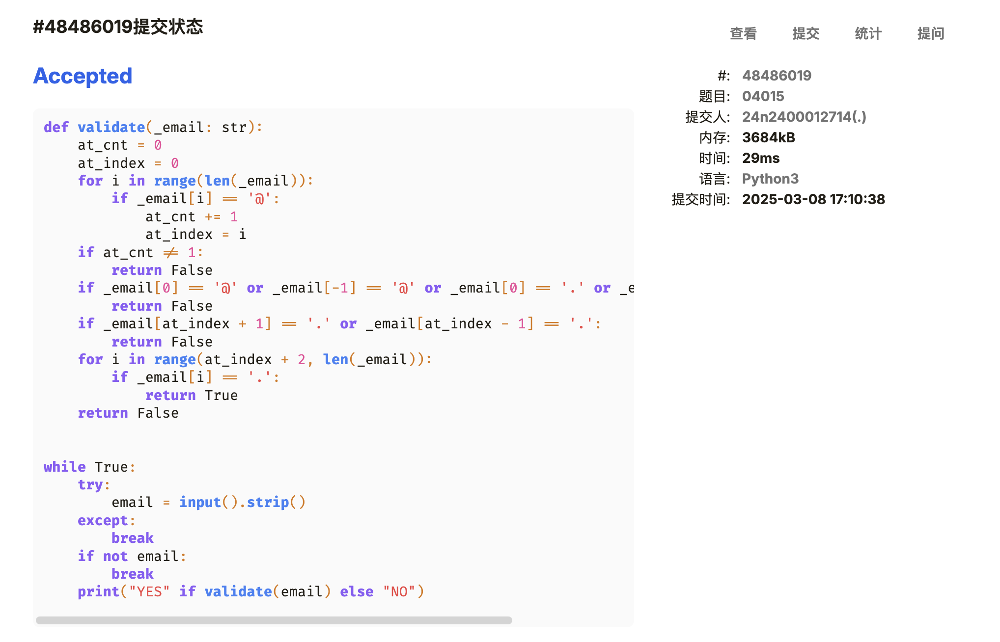
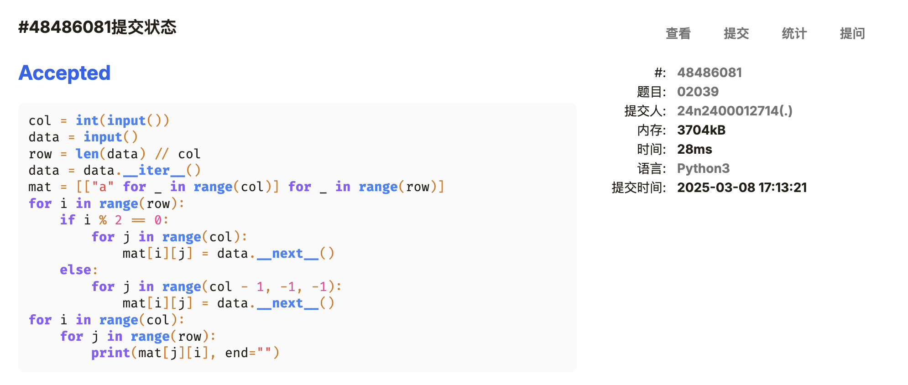
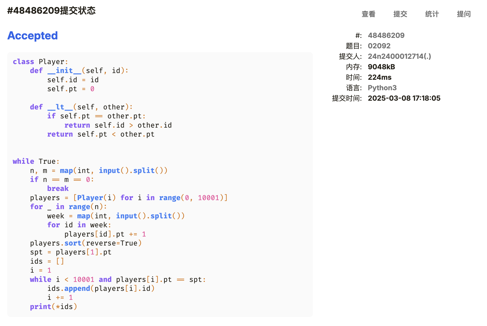
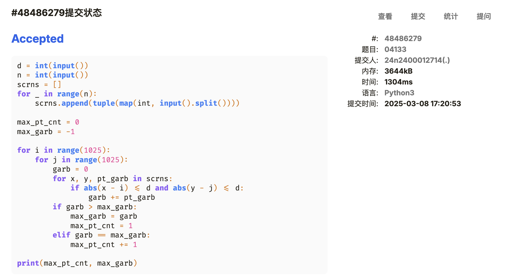
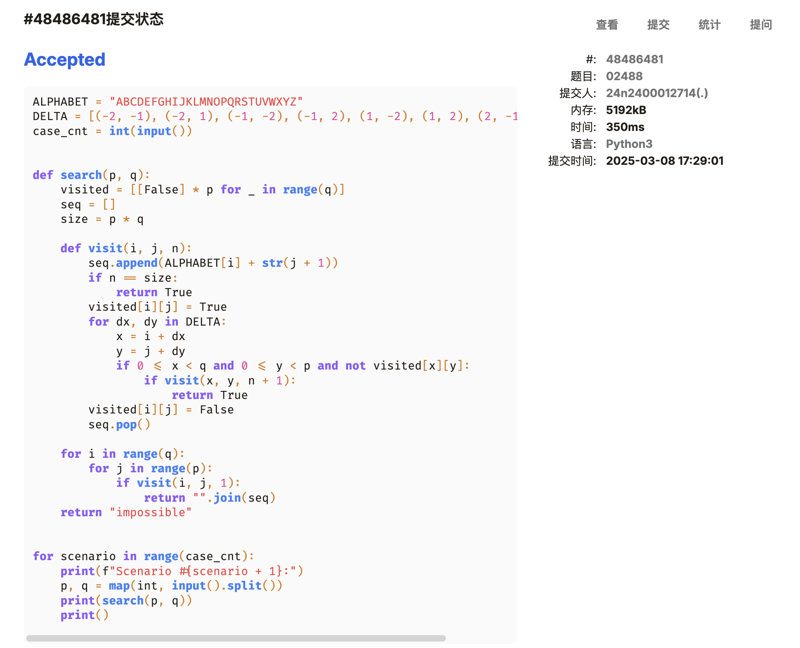
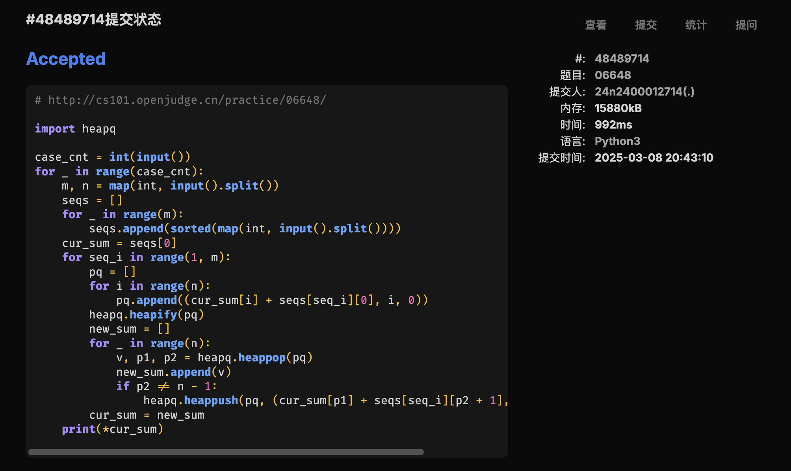
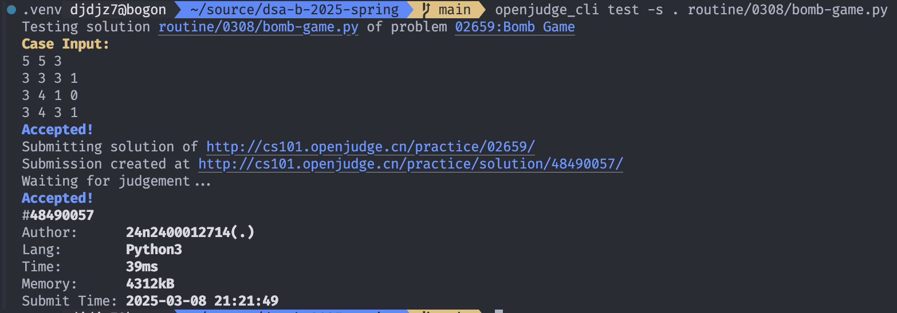

# Assignment #3: 惊蛰 Mock Exam


## 1. 题目

### [E04015: 邮箱验证](http://cs101.openjudge.cn/practice/04015)

#### 思路

耗时最长的一题😅

#### 代码

```python
def validate(_email: str):
    at_cnt = 0
    at_index = 0
    for i in range(len(_email)):
        if _email[i] == "@":
            at_cnt += 1
            at_index = i
    if at_cnt != 1:
        return False
    if _email[0] == "@" or _email[-1] == "@" or _email[0] == "." or _email[-1] == ".":
        return False
    if _email[at_index + 1] == "." or _email[at_index - 1] == ".":
        return False
    for i in range(at_index + 2, len(_email)):
        if _email[i] == ".":
            return True
    return False


while True:
    try:
        email = input().strip()
    except:
        break
    if not email:
        break
    print("YES" if validate(email) else "NO")
```

#### 代码运行截图



### [M02039: 反反复复](http://cs101.openjudge.cn/practice/02039/)

#### 思路

一开始想的是直接写出对应下标的变换公式，但是实在是有点麻烦，况且数据量也不大，还不如直接模拟一遍来得实在。

#### 代码

```python
col = int(input())
data = input()
row = len(data) // col
data = data.__iter__()
mat = [["a" for _ in range(col)] for _ in range(row)]
for i in range(row):
    if i % 2 == 0:
        for j in range(col):
            mat[i][j] = data.__next__()
    else:
        for j in range(col - 1, -1, -1):
            mat[i][j] = data.__next__()
for i in range(col):
    for j in range(row):
        print(mat[j][i], end="")
```

#### 代码运行截图



### [M02092: Grandpa is Famous](http://cs101.openjudge.cn/practice/02092/)

#### 思路

#### 代码

```python
class Player:
    def __init__(self, id):
        self.id = id
        self.pt = 0

    def __lt__(self, other):
        if self.pt == other.pt:
            return self.id > other.id
        return self.pt < other.pt


while True:
    n, m = map(int, input().split())
    if n == m == 0:
        break
    players = [Player(i) for i in range(0, 10001)]
    for _ in range(n):
        week = map(int, input().split())
        for id in week:
            players[id].pt += 1
    players.sort(reverse=True)
    spt = players[1].pt
    ids = []
    i = 1
    while i < 10001 and players[i].pt == spt:
        ids.append(players[i].id)
        i += 1
    print(*ids)
```

#### 代码运行截图



### [M04133: 垃圾炸弹](http://cs101.openjudge.cn/practice/04133/)

#### 思路

看解答是反着遍历能少不少时间？

这样遍历的注意点在于：因为要统计最大值出现的次数，所以 `i`, `j` 这两层循环的范围不能是 $[0, 1025 - d)$。

#### 代码

```python
d = int(input())
n = int(input())
scrns = []
for _ in range(n):
    scrns.append(tuple(map(int, input().split())))

max_pt_cnt = 0
max_garb = -1

for i in range(1025):
    for j in range(1025):
        garb = 0
        for x, y, pt_garb in scrns:
            if abs(x - i) <= d and abs(y - j) <= d:
                garb += pt_garb
        if garb > max_garb:
            max_garb = garb
            max_pt_cnt = 1
        elif garb == max_garb:
            max_pt_cnt += 1

print(max_pt_cnt, max_garb)
```

#### 代码运行截图



### [T02488: A Knight's Journey](http://cs101.openjudge.cn/practice/02488/)

#### 代码

```python
ALPHABET = "ABCDEFGHIJKLMNOPQRSTUVWXYZ"
DELTA = [(-2, -1), (-2, 1), (-1, -2), (-1, 2), (1, -2), (1, 2), (2, -1), (2, 1)]
case_cnt = int(input())


def search(p, q):
    visited = [[False] * p for _ in range(q)]
    seq = []
    size = p * q

    def visit(i, j, n):
        seq.append(ALPHABET[i] + str(j + 1))
        if n == size:
            return True
        visited[i][j] = True
        for dx, dy in DELTA:
            x = i + dx
            y = j + dy
            if 0 <= x < q and 0 <= y < p and not visited[x][y]:
                if visit(x, y, n + 1):
                    return True
        visited[i][j] = False
        seq.pop()

    for i in range(q):
        for j in range(p):
            if visit(i, j, 1):
                return "".join(seq)
    return "impossible"


for scenario in range(case_cnt):
    print(f"Scenario #{scenario + 1}:")
    p, q = map(int, input().split())
    print(search(p, q))
    print()
```

#### 代码运行截图



### [T06648: Sequence](http://cs101.openjudge.cn/practice/06648/)

#### 思路

把序列两个两个合并，合并得到的 $n^2$ 个结果中取小的前 $n$ 个，用堆完成一边计算一边选取的过程。

确实想不到这个解法。

#### 代码

```python
import heapq

case_cnt = int(input())
for _ in range(case_cnt):
    m, n = map(int, input().split())
    seqs = []
    for _ in range(m):
        seqs.append(sorted(map(int, input().split())))
    cur_sum = seqs[0]
    for seq_i in range(1, m):
        pq = []
        for i in range(n):
            pq.append((cur_sum[i] + seqs[seq_i][0], i, 0))
        heapq.heapify(pq)
        new_sum = []
        for _ in range(n):
            v, p1, p2 = heapq.heappop(pq)
            new_sum.append(v)
            if p2 != n - 1:
                heapq.heappush(pq, (cur_sum[p1] + seqs[seq_i][p2 + 1], p1, p2 + 1))
        cur_sum = new_sum
    print(*cur_sum)
```

#### 代码运行截图



## 2. 学习总结和收获

仍在每日选做，LeetCode 倒是不是很有时间做

btw 在写一些很新的东西

