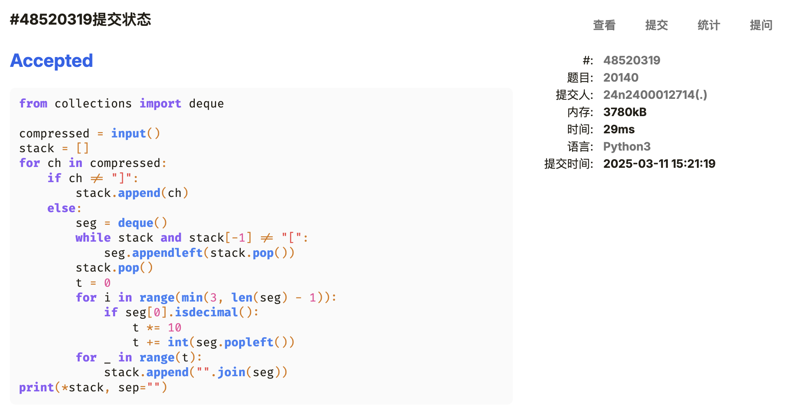
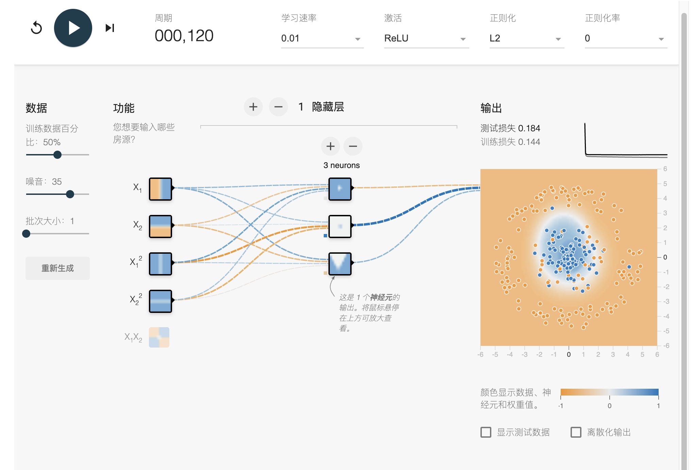
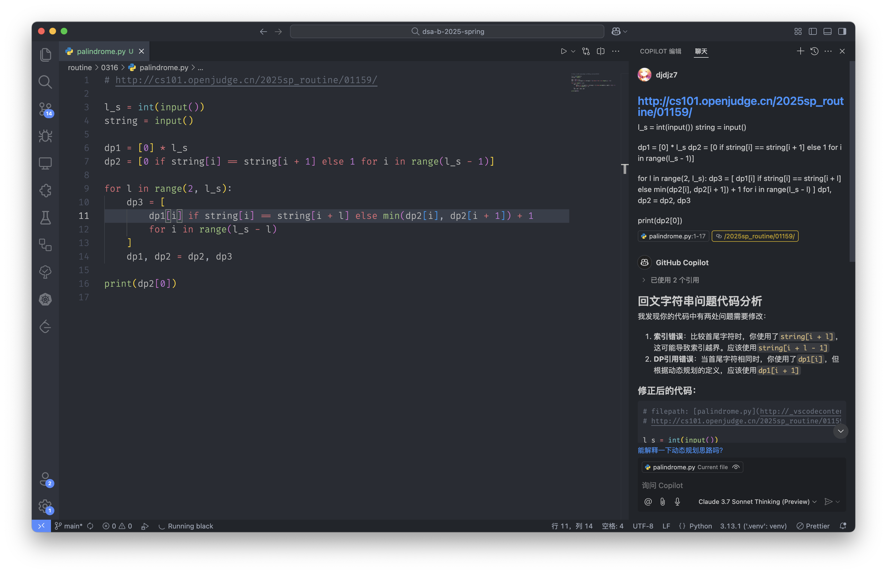

# Assignment #4: 位操作、栈、链表、堆和NN


## 1. 题目

### [136.只出现一次的数字](https://leetcode.cn/problems/single-number/)

#### 代码

```python
class Solution:
    def singleNumber(self, nums: List[int]) -> int:
        t = 0
        for x in nums:
            t ^= x
        return t
```

#### 代码运行截图


### [20140:今日化学论文](http://cs101.openjudge.cn/practice/20140/)

#### 思路

`[xs]` 这真的没有歧义吗？

`[11a]` 可以是 `aaaaaaaaaaa` 也可以是 `1a` 吧，也没有说字符串不含数字。

#### 代码

```python
from collections import deque

compressed = input()
stack = []
for ch in compressed:
    if ch != "]":
        stack.append(ch)
    else:
        seg = deque()
        while stack and stack[-1] != "[":
            seg.appendleft(stack.pop())
        stack.pop()
        t = 0
        for i in range(min(3, len(seg) - 1)):
            if seg[0].isdecimal():
                t *= 10
                t += int(seg.popleft())
        for _ in range(t):
            stack.append("".join(seg))
print(*stack, sep="")
```

#### 代码运行截图



### [160.相交链表](https://leetcode.cn/problems/intersection-of-two-linked-lists/)

#### 思路

非常好双指针👍，第一次做稍显 tricky。

#### 代码

```python
class Solution:
    def getIntersectionNode(
        self, headA: ListNode, headB: ListNode
    ) -> Optional[ListNode]:
        if not headA or not headB:
            return None
        pa = headA
        pb = headB
        while pa != pb:
            pa = pa.next if pa else headB
            pb = pb.next if pb else headA
        return pa
```

#### 代码运行截图


### [206.反转链表](https://leetcode.cn/problems/reverse-linked-list/)

#### 代码

```python
from typing import Optional


# Definition for singly-linked list.
class ListNode:
    def __init__(self, val=0, next=None):
        self.val = val
        self.next = next


class Solution:
    def reverseList(self, head: Optional[ListNode]) -> Optional[ListNode]:
        p0 = None
        p1 = head
        while p1:
            p2 = p1.next
            p1.next = p0
            p0, p1 = p1, p2
        return p0
```

#### 代码运行截图


### [3478.选出和最大的K个元素](https://leetcode.cn/problems/choose-k-elements-with-maximum-sum/)

#### 思路

我怎么写这么长😅。

#### 代码

```python
import heapq
from typing import List


class Solution:
    def findMaxSum(self, nums1: List[int], nums2: List[int], k: int) -> List[int]:
        l = len(nums1)
        ans = [0] * l
        merged = [(nums1[i], nums2[i], i) for i in range(l)]
        merged.sort()
        v = 0
        i = 0
        sum_persisting = 0
        sum_next = 0
        pq = []

        def maintain_pq(nv: int):
            nonlocal sum_next
            if len(pq) < k:
                sum_next += nv
                heapq.heappush(pq, nv)
            elif nv > pq[0]:
                sum_next -= pq[0]
                sum_next += nv
                heapq.heappushpop(pq, nv)

        while i < l:
            v1, v2, idx = merged[i]
            sum_persisting = sum_next
            ans[idx] = sum_persisting
            maintain_pq(v2)
            v = v1
            i += 1
            while i < l and merged[i][0] == v:
                v1, v2, idx = merged[i]
                ans[idx] = sum_persisting
                maintain_pq(v2)
                i += 1
        return ans
```

#### 代码运行截图


### Q6.交互可视化neural network

https://developers.google.com/machine-learning/crash-course/neural-networks/interactive-exercises



步子疑似迈得有点太大了，应该先看完前面的内容的，现在刚刚看完 ML models。

## 2. 学习总结和收获

吐槽 DeepSeek，[Palindrome](http://cs101.openjudge.cn/2025sp_routine/01159/) 这道题 dp 数组少写了个 +1，直接把代码扔给 DeepSeek 是找不出错误的，一定要告诉他这段代码有问题才行， Claude 3.7 Sonnet Thinking 倒是可以直接指出错误。

### 代码

```python
# http://cs101.openjudge.cn/2025sp_routine/01159/

l_s = int(input())
string = input()

dp1 = [0] * l_s
dp2 = [0 if string[i] == string[i + 1] else 1 for i in range(l_s - 1)]

for l in range(2, l_s):
    dp3 = [
        dp1[i] if string[i] == string[i + l] else min(dp2[i], dp2[i + 1]) + 1
        #   ^ 这个地方应该是 i + 1
        for i in range(l_s - l)
    ]
    dp1, dp2 = dp2, dp3

print(dp2[0])
```

### DeepSeek R1

> 好的，我现在得仔细看看这个问题。题目是说，给定一个字符串，要求通过添加或删除字符，使其变成回文，并且操作> 的次数最少。那么这道题应该用动态规划的方法来解决吧。我需要仔细分析这个问题，然后写出正确的状态转移方程。
>
> 首先，题目中的例子是这样的：比如输入字符串是Ab3bd，那么最少需要添加两个字符，比如添加d和A，变成> dAb3bAd，或者其他的可能。或者可能删除原有的字符，比如删除A和d，得到b3b，这样操作次数是两次。所以，无> 论添加还是删除，其实操作次数是一样的，因为题目允许添加或删除。那我们的目标就是找出最小的操作次数，使得原> 字符串变成回文。
>
> 那动态规划的思路应该是怎样的呢？假设我们有一个子问题，即对于字符串s的子串s[i...j]，需要多少次操作才能> 变成回文。这时候，我们可以建立一个二维数组dp[i][j]，表示子串i到j的最小操作次数。然后状态转移方程需要考> 虑以下几种情况：
>
> 当s[i]等于s[j]的时候，那么这两个字符不需要操作，只需要考虑i+1到j-1之间的子串的最小操作次数，即dp[i]> [j] = dp[i+1][j-1]。
>
> 当s[i]不等于s[j]的时候，有两种可能的操作方式：要么在右边添加一个s[i]，或者在左边添加一个s[j]。或者，> 可以删除左边的s[i]，或者删除右边的s[j]。这两种情况对应的操作次数是相同的，都是1加上更小的子问题解。例> 如，添加一个字符相当于处理i到j-1的子问题，或者i+1到j的子问题。所以这时候，dp[i][j] = min(dp[i+1]> [j], dp[i][j-1]) +1。
>
> 这样，动态规划的递推式就建立起来了。初始条件是，当i等于j的时候，子串长度为1，已经是回文，操作次数为0。> 当i+1等于j的时候，即子串长度为2，如果两个字符相同，操作次数0；否则，需要1次操作。
>
> 那么，如何按照这个思路来填充dp数组呢？通常，动态规划处理这类问题需要按子串的长度从小到大来处理。例如，先> 处理所有长度为1的子串，然后是长度为2，直到整个字符串的长度。
>
> 但是，在给定的Python代码中，似乎用了滚动数组的方法来优化空间复杂度。原题中的代码看起来是用了三个一维数> 组：dp1，dp2，dp3。我需要仔细分析这段代码的逻辑，看看是否正确实现了上述的动态规划思路。
>
> 让我们仔细看一下给出的代码：
>
> 初始时，l_s是字符串的长度。string是输入的字符串。
>
> dp1被初始化为全0数组，长度为l_s。这可能对应长度为1的子串的情况，因为每个单独的字符本身都是回文，不需要> 操作。例如，当子串长度为1时，dp[i][i] =0。这里的dp1可能代表长度为l-2的情况？或者可能作者在这里用了不> 同的方式处理。
>
> 然后，dp2被初始化为一个列表推导式，其中i的范围是0到l_s-2。每个元素的值是0或1，根据string[i]和> string[i+1]是否相等。这应该对应的是长度为2的子串的情况。比如，当i和i+1位置的字符相同，则不需要操作，> 否则需要1次操作。所以，对于每个长度为2的子串，dp[i][i+1]的值是0或1。
>
> 接下来是循环，从l=2开始到l_s-1。这里可能循环变量l代表的是子串的长度减一？或者需要再仔细看。因为原来的> 子串长度是从1开始的，比如当l=2时，处理的子串长度应该是3？或者可能这里的循环变量是子串的长度。比如，当l> 的取值是2，那么处理的子串长度是2？或者可能代码中的循环逻辑需要重新分析。
>
> 例如，假设当前的l是子串的长度，那么对于长度为l的子串来说，我们需要计算所有可能的起始位置i，使得i到i> +l-1是一个有效的子串。例如，当子串长度为l时，i的取值范围是0到l_s - l。那在代码中的循环部分，当循环变> 量是l的时候，处理的子串长度是l+1？或者可能代码中的循环变量l代表的是长度，或者其他的？
>
> 原代码中的循环结构是：
>
> for l in range(2, l_s):
>
> dp3 = [
>
> dp1[i] if string[i] == string[i + l] else min(dp2[i], dp2[i+1]) +1
>
> for i in range(l_s - l)
>
> ]
>
> dp1, dp2 = dp2, dp3
>
> 这里，假设原字符串的长度是n。对于每个子串的起始位置i，其结束位置是i+l。例如，当处理长度l的子串时，例如> 当l=2的时候，i的范围是0到n-2-1？或者这里可能有错误？
>
> 或者，可能这个循环处理的是不同的子串长度。例如，当循环变量l的值从2到n-1时，每次处理的是长度为l的子串。> 比如，初始的dp2对应的是长度为2的子串吗？或者初始时dp2对应的是长度为2的子串？比如，在初始的时候，dp2的> 长度是n-1，对应每个i，i到i+1的位置。所以长度为2的子串。当l=2时，现在循环中的处理是处理长度为3的子串？
>
> 例如，假设当前处理的子串长度是l+1？因为当l=2时，i + l的位置是i+2，那么子串从i到i+l的长度是 l+1？比> 如，当i=0，l=2时，子串是0到2，长度是3。所以，循环变量l从2到n-1，处理的是子串长度从3到n的情况？
>
> 这可能吗？例如，当原字符串长度是5时，最大的子串长度是5。此时，当l的取值是4（因为循环是range(2, 5)，即> l=2,3,4），每次处理的子串长度是3,4,5。因为当l=4时，子串长度是5。例如，i的范围是0到5-4-1？或者 5-4 > =1，所以i的范围是0到1？比如，当l=4时，i的取值只能是0，对应的子串是0到4，长度5。
>
> 这样，这段代码中的循环结构应该是在处理不同长度的子串，而每次处理的子串长度是当前的l的值。或者可能需要重> 新考虑。
>
> 例如，初始时，当字符串长度为n：
>
> - dp1的长度是n，每个元素代表长度为1的子串的dp值，即每个字符自己，所以都是0。
> - dp2的长度是n-1，每个元素代表长度为2的子串i到i+1的dp值，即初始条件是0或1。
> - 然后循环变量l从2开始，到n-1。例如，当n=5时，循环中的l取2,3,4。
> - 在每次循环中，dp3的长度应该是n - l。例如，当处理长度为l+1的子串时，i的取值范围是0到n - (l+1) 的> 位置？或者可能要看具体的情况。
>
> 例如，在循环的第一次迭代，l=2。此时，处理的子串的长度是2+1=3？或者可能这个逻辑搞反了？
>
> 假设现在处理的是长度为l+1的子串。比如，当l=2时，处理的是长度为3的子串。这个时候，对于每个i，子串的起始> 位置是i，结束位置是i + l。比如，i的取值范围是0到n - l - 1。例如，如果n是5，l是2，那么i的范围是0到> 5-2-1=2？或者可能不是这样？
>
> 或者，循环中的l代表的是子串的长度减去1。例如，当处理长度为l的子串时，可能需要重新计算。这个时候，初始的> dp2对应的是长度为2的子串，而循环中的处理对应的是更长的子串。
>
> 或者，假设在每次循环中，我们处理的是长度为l+1的子串。例如，初始时，dp2是长度为2的子串的情况。当l=2时，> 处理的是长度为3的子串。此时，计算dp3的值，然后dp1和dp2被更新。这样，在每次循环中，处理的子串长度依次增> 加。
>
> 现在来看dp3的生成方式：
>
> dp3的每个元素是根据string[i]和string[i+l]是否相等。例如，当处理子串i到i+l的时候，长度为l+1？比> 如，当i=0，l=2，则子串是0到2，长度3。这时候，如果首尾字符相等，那么取dp1[i]的值。否则，取min(dp2> [i], dp2[i+1]) +1。
>
> 这里的dp1、dp2、dp3可能对应不同的子问题。例如，当处理子串i到i+l时，如果首尾字符相等，那么问题转化为子> 串i+1到 i+l-1的情况。而这个时候，这个子串的长度是 l-1。例如，如果当前处理的子串长度是 l+1，那么子串i> +1到 i+l-1的长度是 (i+l-1) - (i+1) +1= l-1-1+1= l-1？或者可能需要重新计算。
>
> 这可能需要重新分析每个dp数组所代表的含义。
>
> 例如，假设原来的二维数组dp[i][j]表示子串从i到j的最小操作次数。那么，当处理子串i到j时，如果i和j的字符> 相同，那么dp[i][j] = dp[i+1][j-1]。否则，dp[i][j] = min(dp[i+1][j], dp[i][j-1]) +1。
>
> 现在，如果我们想要用滚动数组来优化空间，因为每次计算当前长度的子串时，只需要前两个长度的结果。比如，当计> 算长度为L的子串时，只需要长度为L-1和L-2的结果？
>
> 或者，可能原来的代码中，dp1保存的是长度为L-1的结果，dp2保存的是长度为L的结果，而dp3则是当前处理的结> 果？
>
> 或者，可能作者在这里用了一种不同的状态转移方式，比如，将状态i和j转化为i和j的差值。例如，对于每个可能的> 子串长度，我们用不同的数组来保存当前的结果。
>
> 假设，在原始代码中，当处理子串长度是l的时候，比如，当前的子串是i到i+l，此时，长度是l+1？
>
> 或者，可能这里的l代表的是子串的长度减一。例如，当l=0时，处理的是长度为1的子串，当l=1时，处理的是长度为> 2的子串，依此类推。
>
> 这个时候，原循环中的l从2到l_s-1可能对应处理长度为3到l_s的子串？
>
> 这个时候，当处理长度为L的子串时，对应的循环变量是l = L-1。例如，当L=3时，循环变量l=2。
>
> 在这种情况下，dp1保存的是长度为L-2的子串的dp值，dp2保存的是长度为L-1的子串的dp值。这样，当处理长度为> L的子串时，可以用到这两个数组的值。
>
> 例如，当处理子串i到i+l（即长度为 l+1）时，此时如果首尾字符相等，那么dp[i][i+l] = dp[i+1][i> +l-1]。而 dp[i+1][i+l-1] 对应的子串长度是 (i+l-1) - (i+1) +1 = l-1。所以，此时对应的长度是 (l> +1)-2 = l-1。例如，当当前处理的长度是 l+1，那么子串i+1到i+l-1的长度是 (l+1)-2 = l-1。此时，dp1> 可能保存的是长度为 (l+1) -2 -1 = l-2的子串的dp值？或者可能我的思路有问题。
>
> 这可能需要更仔细的分析。
>
> 例如，原代码中的循环变量l的取值从2到l_s-1，假设原字符串长度是n。例如，当n=5时，循环中的l取2、3、4。
>
> 当处理每个l的时候，生成dp3数组。其中，每个元素i对应的子串是i到i+l？例如，当i=0，l=2时，子串是0-2，也> 就是三个字符。此时，如果首尾字符相等，那么取dp1[i]的值。否则，取min(dp2[i], dp2[i+1]) +1。
>
> 这个时候，假设在计算dp3[i]的时候，对应的是子串i到i+l的情况。此时，首字符是string[i]，尾字符是> string[i+l]。如果这两个相等，那么不需要操作，所以dp3[i]等于dp[i+1][i+l-1]的值。而 dp[i+1][i> +l-1]对应的子串长度是 (i+l-1) - (i+1) +1 = l-1。此时，假设这个子串的长度是 l-1，那么对应的dp数组> 应该是在更早的循环中被计算过的。例如，dp1可能保存的是长度l-1对应的结果？
>
> 或者，此时可能需要更详细地跟踪数组的转换过程。
>
> 例如，初始时：
>
> - dp1保存的是长度为1的子串的结果。因为每个dp1[i]初始化为0，对应每个字符自己。
> - dp2保存的是长度为2的子串的结果。例如，i从0到n-2，每个元素是0或1，根据相邻两个字符是否相等。
>
> 在第一次循环中，l=2：
>
> 此时，处理的是长度为l的子串？或者长度为l+1？或者，假设现在处理的是长度为3的子串？因为当l=2时，i+l的范> 围是i+2，所以子串从i到i+2的长度是3。所以，处理的是长度为3的子串。
>
> 此时，对于每个i，我们需要计算dp3[i]，即子串i到i+2的最小操作次数。
>
> 这时候，如果string[i]等于string[i+2]，那么dp3[i]等于dp1[i]，即子串i+1到 i+1（长度为1）的结果。> 因为原来的子串i+1到 i+2-1即i+1到i+1，长度是1。此时，dp1[i]是0。所以，在这种情况下，dp3[i]为0。这> 说明，当首尾字符相等时，整个子串的最小操作次数等于中间子串的操作次数。
>
> 否则，当首尾字符不相等时，需要比较两种情况：删除首字符后的子串i+1到 i+2的操作次数，或者删除尾字符后的子> 串i到 i+1的操作次数，然后取较小的那个加一。这个时候，这两个子串的长度是2，对应的dp值是dp2[i+1]和dp2> [i]。例如，子串i+1到i+2对应dp2[i+1]，而子串i到i+1对应dp2[i]。所以，min(dp2[i], dp2[i+1]) > +1。
>
> 此时，dp3的计算是正确的。因为对于长度为3的子串i到i+2，当首尾不等时，取更小的子问题的结果加一。
>
> 然后，dp1和dp2被更新。原来的dp2（长度为2）变成dp1，而新的dp3（长度为3）变成dp2。这样，在下一轮循环> 中，处理长度为4的子串时，需要用到之前的结果。
>
> 这样，每次循环处理的是长度递增的情况。例如，初始的dp2是长度为2的情况，处理之后，l=2时得到的是长度为3的> dp3数组，之后在下一轮循环中，处理长度为4的情况，以此类推，直到处理到整个字符串的长度。
>
> 所以，这段代码的总体思路是正确的。那么，为什么原题中的测试用例会得到正确的结果呢？比如，假设测试用例是> Ab3bd，长度5。那么，当处理到长度为5的子串时，即整个字符串，此时得到的dp2[0]的值应该是正确的吗？
>
> 例如，原题中的测试用例：
>
> 输入为5，然后字符串是Ab3bd。那么，正确的输出应该是2。原代码是否能得到这个结果？
>
> 让我们手动模拟一下代码的执行过程：
>
> 原字符串是长度为5的：索引0到4。字符分别是A、b、3、b、d。
>
> 初始的dp1是[0,0,0,0,0]。dp2的长度是4（n-1=5-1=4），每个元素对应长度为2的子串：
>
> i=0: A和b →不等 →1.
>
> i=1: b和3 →1.
>
> i=2:3和b →1.
>
> i=3: b和d →1.
>
> 所以，dp2初始化为[1,1,1,1].
>
> 然后进入循环，l从2到4（因为n=5，循环到l_s-1即4）。循环处理l=2、3、4的情况。
>
> 处理l=2时（对应子串长度3）：
>
> 对于i的范围是5 -2=3？或者原代码中的range(l_s -l) →5-2=3，所以i从0到2（因为range(3)是0,1,2）。
>
> 对于每个i，计算string[i]和string[i+2]是否相等。然后生成dp3数组。
>
> i=0:
>
> 字符是A和3 →不等。此时取min(dp2[0], dp2[1]) +1 →min(1,1)+1=2.
>
> i=1:
>
> 字符是b和b →相等。所以dp3[1] = dp1[1] =0.
>
> i=2:
>
> 字符是3和d →不等。取min(dp2[2], dp2[3]) →1和1 →min是1 →+1得到2.
>
> 所以，dp3是 [2,0,2].
>
> 然后，dp1和dp2被更新：dp1 =原来的dp2 [1,1,1,1], dp2= dp3 [2,0,2]. 注意此时dp2的长度是3。
>
> 接下来处理l=3（对应子串长度4）：
>
> 此时，i的取值范围是l_s - l=5-3=2 →range(2) →i=0,1.
>
> 对于每个i：
>
> i=0:
>
> 检查string[0]和string[0+3] →A和b →不等。取min(dp2[0], dp2[1]) +1 →dp2是当前的状态，即原来的> dp3的值。此时dp2是 [2,0,2]. 所以，i=0时，dp2[0]=2，dp2[1]=0 →min是0 →0+1=1.
>
> i=1:
>
> 检查string[1]和string[4] →b和d →不等。取min(dp2[1], dp2[2]) →0和2 →min是0 →+1=1.
>
> 所以，dp3是 [1,1].
>
> 然后，dp1和dp2被更新：dp1 =之前的dp2 [2,0,2], dp2 = [1,1].
>
> 处理l=4（对应子串长度5）：
>
> i的取值范围是5-4=1 →range(1) →i=0.
>
> 检查string[0]和string[4] →A和d →不等。取min(dp2[0], dp2[1]) →当前dp2是 [1,1]. min是1 →> +1=2.
>
> 所以，dp3 = [2].
>
> 最后，dp2被赋值为dp3，即dp2[0] =2。所以输出dp2[0]得到2，是正确的。
>
> 这说明代码是正确的，可以处理测试用例。那原题中的代码应该是正确的。那问题可能出在哪里？
>
> 可能原题中的测试用例是正确的，那么这段代码应该能够通过所有测试用例。那用户的问题可能在于如何理解这段代> 码，或者是否有特殊情况没有被处理？
>
> 例如，当输入的字符串长度为1时，代码中的循环不会执行，因为l的起始是2，而l_s是1的话，循环条件range(2,> 1) 不成立。此时，dp2没有被初始化吗？或者当输入长度为1时，原代码中的string的输入是长度为1，那么l_s > =1。此时，dp2的初始化是生成一个列表推导式，其中i的范围是l_s-1=0，所以i从0到-1？或者原代码中，当> l_s=1时，i的范围是0到l_s-2= -1，所以列表推导式不会执行，得到的dp2是一个空列表。但是在最后输出dp2> [0]时会报错，因为当输入长度为1时，代码会进入初始化dp2，此时i的范围是0到-1，所以得到的dp2是空列表。然> 后在最后输出dp2[0]时，会抛出索引错误。所以，这段代码在处理长度为1的输入时会出错？
>
> 例如，当输入字符串长度为1时，输出应该是0，因为已经是回文。但原代码的初始化中，dp2会被初始化为一个空列> 表，然后最后输出dp2[0]会报错。所以，这段代码在处理长度为1的情况下会出错。
>
> 比如，当输入：
>
> 1
>
> A
>
> 那么，原代码中：
>
> l_s =1.
>
> string = 'A'.
>
> dp1初始化为 [0].
>
> dp2初始化为 [ if ... for i in range(0, 1-1) ] →因为 1-1=0，所以range(0)是空，所以dp2是空列> 表。
>
> 然后循环条件是 for l in range(2,1)，即不执行循环。最后输出dp2[0]会报错，因为dp2是空的。
>
> 这说明代码存在漏洞，没有处理输入字符串长度为1的情况。这可能是一个问题。
>
> 那原题中的测试用例是否包含长度为1的情况？或者原题的测试数据是否考虑了这种情况？
>
> 例如，原题的测试用例可能没有长度为1的情况，所以该代码可以AC。或者，可能题目中给出的字符串长度是大于等于> 1的，但代码没有处理长度为1的情况。
>
> 因此，这段代码需要修改以处理这种情况。或者，原题中的测试数据中没有长度为1的情况，所以该代码可以正确通> 过。
>
> 那为什么用户给出的代码中，可能对于长度为1的情况无法处理？
>
> 例如，当输入的字符串长度为1时，根据问题描述，此时输出应为0。但原代码中在这种情况下，最后会输出dp2[0]，> 而dp2是空列表，导致错误。所以，这段代码存在错误。
>
> 那么，正确的做法应该是，在代码的开始，先处理长度为0或1的特殊情况。例如：
>
> if l_s == 0:
>
> print(0)
>
> elif l_s ==1:
>
> print(0)
>
> else:
>
> ...原来的代码...
>
> 或者，在初始时，当l_s ==1时，直接输出0。
>
> 那原题中的代码是否有这样的处理？从用户给出的代码来看，没有。因此，这段代码在处理长度为1的输入时会出错。
>
> 那这说明用户提供的代码可能在某些测试用例下无法通过，例如当输入字符串长度为1时。
>
> 但是原题中的题目可能给出的测试数据中没有这样的例子，或者原题中的输入保证字符串长度至少为1？或者题目中的> 输入可能有其他限制？
>
> 例如，原题的问题链接是：http://cs101.openjudge.cn/2025sp_routine/01159/。可能查看该题的描述是> 否有这样的限制？
>
> 根据题目描述，输入的字符串长度是给定的，可能可以是任意正整数，包括1。所以，这段代码存在漏洞。
>
> 因此，正确的做法是在代码中处理长度为0或1的情况。例如，在代码开始处添加：
>
> if l_s <=1:
>
> print(0)
>
> exit()
>
> 或者类似的处理。
>
> 然而，用户给出的代码没有这样的处理，这说明在遇到长度为1的输入时会出错。这可能是一个错误。
>
> 那如何修改这段代码呢？
>
> 可以在代码的开头加入对长度为1的情况的判断：
>
> l_s = int(input())
>
> string = input()
>
> if l_s == 0:
>
> print(0)
>
> exit()
>
> if l_s == 1:
>
> print(0)
>
> exit()
>
> # 原来的代码...
>
> 这样，当输入长度为1时，直接输出0，而不会执行后面的代码。
>
> 否则，当输入长度为1时，代码会抛出错误。
>
> 所以，用户给出的代码存在错误，无法正确处理长度为1的情况。这可能是一个问题。
>
> 除此之外，其他情况是否正确处理？
>
> 比如，当输入长度为0？根据原题，可能输入长度至少为1？
>
> 总之，这段代码的正确性依赖于输入的字符串长度大于等于2。当输入长度为1时，代码会出错。因此，这段代码是错误> 的。
>
> 那原题中的测试数据是否包含这样的例子？如果包含的话，这段代码将无法通过。所以，需要修正这个错误。
>
> 综上，用户给出的代码在处理长度为1的输入时会出错。需要添加对这种情况的处理。
>
> 此外，其他情况下的代码逻辑是否正确？
>
> 比如，当字符串长度为3时，是否正确？
>
> 例如，假设输入字符串为aba，长度为3。此时，正确的最小操作次数是0，因为已经是回文。原代码的处理过程：
>
> 初始时，dp1是[0,0,0], dp2的初始是每个i检查i和i+1的字符是否相等。
>
> i=0: a和b →不等 →1.
>
> i=1: b和a →不等 →1.
>
> 所以，dp2初始化为 [1,1].
>
> 然后循环中处理l=2（即子串长度3）:
>
> i的取值范围是3-2=1 →range(1) →i=0.
>
> 检查string[0]和string[0+2] =a和a →相等。所以，dp3[0] = dp1[0] =0.
>
> 此时，dp3是 [0]. 然后 dp1和dp2被更新，dp2现在是 [0]. 最后输出dp2[0] →0，正确。
>
> 这说明代码在这种情况下是正确的。
>
> 那总的来说，除了长度为1的情况，其他情况下代码是正确的。因此，用户给出的代码需要修正这个边界条件。

为了解决这个问题，我们需要将给定的字符串转换为回文，并且要求操作次数最少。我们可以使用动态规划来高效地解决这个问题。动态规划的思路是通过子问题的解逐步构建出整个问题的解，从而避免重复计算。

### 方法思路

1. **问题分析**：回文问题可以通过动态规划来解决，其中子问题定义为将子字符串转换为回文所需的最少操作次数。
2. **状态定义**：使用二维数组 `dp[i][j]` 表示将子字符串从索引 `i` 到 `j` 转换为回文所需的最少操作次数。
3. **状态转移**：
   - 如果首尾字符相同，则 `dp[i][j] = dp[i+1][j-1]`。
   - 如果首尾字符不同，则 `dp[i][j] = min(dp[i+1][j], dp[i][j-1]) + 1`，分别对应删除首字符或尾字符的情况。
4. **优化空间**：使用滚动数组来优化空间复杂度，只保留当前层和上一层的状态，减少内存使用。

### 解决代码

```python
l_s = int(input())
string = input()

if l_s <= 1:
    print(0)
    exit()

dp1 = [0] * l_s
dp2 = [0 if string[i] == string[i + 1] else 1 for i in range(l_s - 1)]

for l in range(2, l_s):
    dp3 = [
        dp1[i] if string[i] == string[i + l] else min(dp2[i], dp2[i + 1]) + 1
        for i in range(l_s - l)
    ]
    dp1, dp2 = dp2, dp3

print(dp2[0])
```

### 代码解释

1. **输入处理**：读取字符串长度和字符串本身。
2. **边界处理**：如果字符串长度小于等于1，直接输出0，因为已经是回文。
3. **初始化**：
   - `dp1` 数组处理长度为1的子字符串，初始化为0。
   - `dp2` 数组处理长度为2的子字符串，根据首尾字符是否相同初始化为0或1。
4. **动态规划循环**：从长度为3开始逐步处理更长的子字符串，使用滚动数组优化空间复杂度。
5. **结果输出**：最终结果存储在 `dp2[0]` 中，表示整个字符串转换为回文的最少操作次数。

这种方法通过动态规划逐步构建子问题的解，并使用滚动数组优化空间，确保了高效的时间和空间复杂度。

### Claude 3.7 Sonnet Thinking


