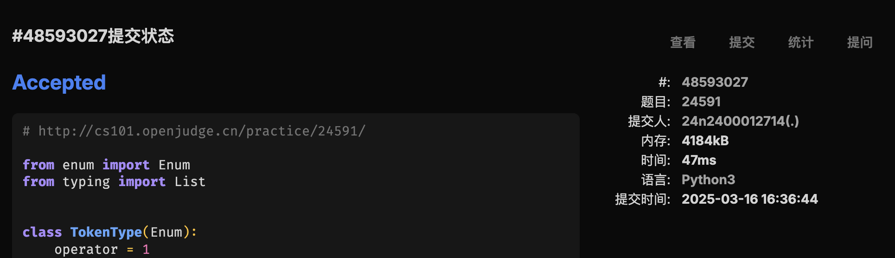
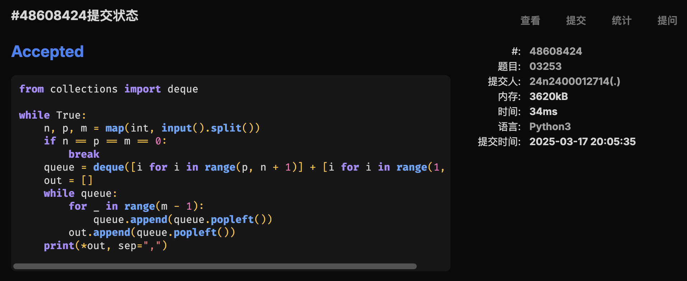
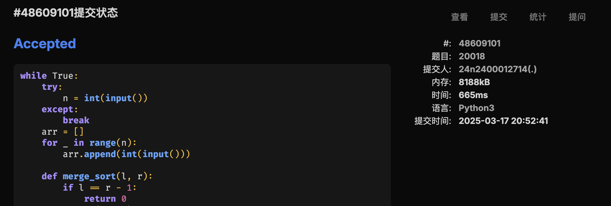

# Assignment #5: 链表、栈、队列和归并排序


## 1. 题目

### [LC21.合并两个有序链表](https://leetcode.cn/problems/merge-two-sorted-lists/)

#### 代码

```python
class Solution:
    def mergeTwoLists(
        self, list1: Optional[ListNode], list2: Optional[ListNode]
    ) -> Optional[ListNode]:
        h1 = list1
        h2 = list2
        dummy = ListNode()
        current = dummy
        while h1 and h2:
            if h1.val < h2.val:
                current.next = h1
                h1 = h1.next
            else:
                current.next = h2
                h2 = h2.next
            current = current.next
        current.next = h1 if h1 else h2
        return dummy.next
```

#### 代码运行截图


### [LC234.回文链表](https://leetcode.cn/problems/palindrome-linked-list/)

#### 代码

```python
from typing import Optional


class ListNode:
    def __init__(self, val=0, next=None):
        self.val = val
        self.next = next


class Solution:
    def reverse(self, head):
        p1 = None
        p2 = head
        while p2:
            p3 = p2.next
            p2.next = p1
            p1, p2 = p2, p3
        return p1

    def isPalindrome(self, head: Optional[ListNode]) -> bool:
        if not head:
            return True
        dummy = ListNode(next=head)
        length = 0
        slow, fast = dummy, dummy
        while fast:
            length += 1
            fast = fast.next
            if fast:
                length += 1
                fast = fast.next
            slow = slow.next
        tail = self.reverse(slow)
        while tail:
            if head.val != tail.val:
                return False
            head = head.next
            tail = tail.next
        return True
```

#### 代码运行截图


### [LC1472.设计浏览器历史记录](https://leetcode.cn/problems/design-browser-history/)

#### 代码

```python
class ListNode:
    def __init__(self, val):
        self.val = val
        self.prev = None
        self.next = None


class BrowserHistory:

    def __init__(self, homepage: str):
        self.head = ListNode(homepage)
        self.current = self.head

    def visit(self, url: str) -> None:
        self.current.next = ListNode(url)
        self.current.next.prev = self.current
        self.current = self.current.next

    def back(self, steps: int) -> str:
        while steps > 0 and self.current.prev:
            self.current = self.current.prev
            steps -= 1
        return self.current.val

    def forward(self, steps: int) -> str:
        while steps > 0 and self.current.next:
            self.current = self.current.next
            steps -= 1
        return self.current.val
```

#### 代码运行截图


### [24591: 中序表达式转后序表达式](http://cs101.openjudge.cn/practice/24591/)

#### 代码

```python
from enum import Enum
from typing import List


class TokenType(Enum):
    operator = 1
    number = 2
    left_bracket = 3
    right_bracket = 4


class Token:
    __slots__ = ["type", "data"]

    def __init__(self, token_type: TokenType, data):
        self.type = token_type
        self.data = data


def parse(infix):
    num_ch = "1234567890."
    tokens = []
    num = ""
    for ch in infix:
        if ch in num_ch:
            num += ch
        else:
            if num:
                tokens.append(Token(TokenType.number, num))
                num = ""
            if ch in "+-*/":
                tokens.append(Token(TokenType.operator, ch))
            elif ch == "(":
                tokens.append(Token(TokenType.left_bracket, None))
            else:
                tokens.append(Token(TokenType.right_bracket, None))
    if num:
        tokens.append(Token(TokenType.number, num))
    return tokens


def transform(infix: List[Token]):
    precedence = {"+": 1, "-": 1, "*": 2, "/": 2}
    output = []
    operators = []
    for token in infix:
        if token.type == TokenType.number:
            output.append(token)
            continue
        if token.type == TokenType.left_bracket:
            operators.append(token)
            continue
        if token.type == TokenType.right_bracket:
            while operators[-1].type != TokenType.left_bracket:
                output.append(operators.pop())
            operators.pop()
            continue
        while (
            operators
            and operators[-1].type != TokenType.left_bracket
            and precedence[operators[-1].data] >= precedence[token.data]
        ):
            output.append(operators.pop())
        operators.append(token)
    while operators:
        output.append(operators.pop())
    return output


n = int(input())
for i in range(n):
    infix = parse(input().strip())
    suffix = transform(infix)
    print(*map(lambda x: x.data, suffix))
```

#### 代码运行截图



### [03253: 约瑟夫问题No.2](http://cs101.openjudge.cn/practice/03253/)

#### 代码

```python
from collections import deque

while True:
    n, p, m = map(int, input().split())
    if n == p == m == 0:
        break
    queue = deque([i for i in range(p, n + 1)] + [i for i in range(1, p)])
    out = []
    while queue:
        for _ in range(m - 1):
            queue.append(queue.popleft())
        out.append(queue.popleft())
    print(*out, sep=",")
```

#### 代码运行截图



### [20018: 蚂蚁王国的越野跑](http://cs101.openjudge.cn/practice/20018/)

#### 思路

这不就是 [Ultra-QuickSort](http://cs101.openjudge.cn/25dsapre/02299/)

#### 代码

```python
while True:
    try:
        n = int(input())
    except:
        break
    arr = []
    for _ in range(n):
        arr.append(int(input()))

    def merge_sort(l, r):
        if l == r - 1:
            return 0
        mid = (l + r) // 2
        ans = merge_sort(l, mid) + merge_sort(mid, r)
        temp = []
        lp, rp = l, mid
        while lp < mid and rp < r:
            if arr[lp] >= arr[rp]:
                temp.append(arr[lp])
                lp += 1
            else:
                temp.append(arr[rp])
                ans += mid - lp
                rp += 1
        while lp < mid:
            temp.append(arr[lp])
            lp += 1
        while rp < r:
            temp.append(arr[rp])
            rp += 1
        for i in range(l, r):
            arr[i] = temp[i - l]
        return ans

    print(merge_sort(0, len(arr)))
    print()
    input()
```

#### 代码运行截图



## 2. 学习总结和收获

继续每日选做。

很多自己寒假做过的题目现在又已经忘得差不多了，表达式转换的题目又卡了很久。