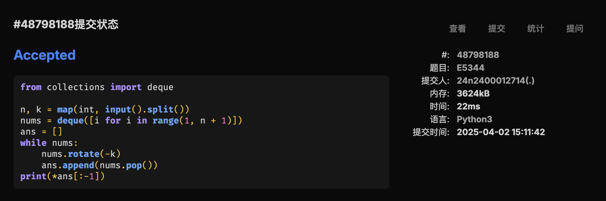
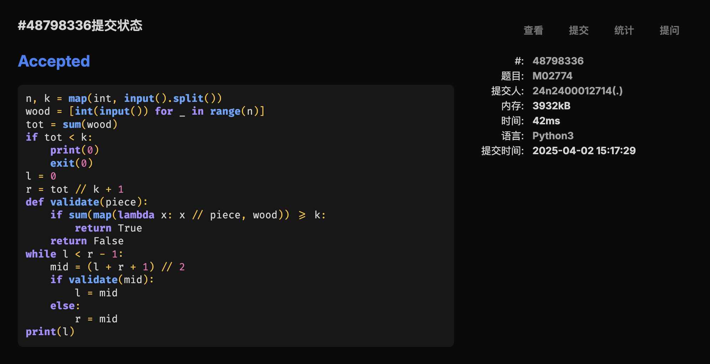
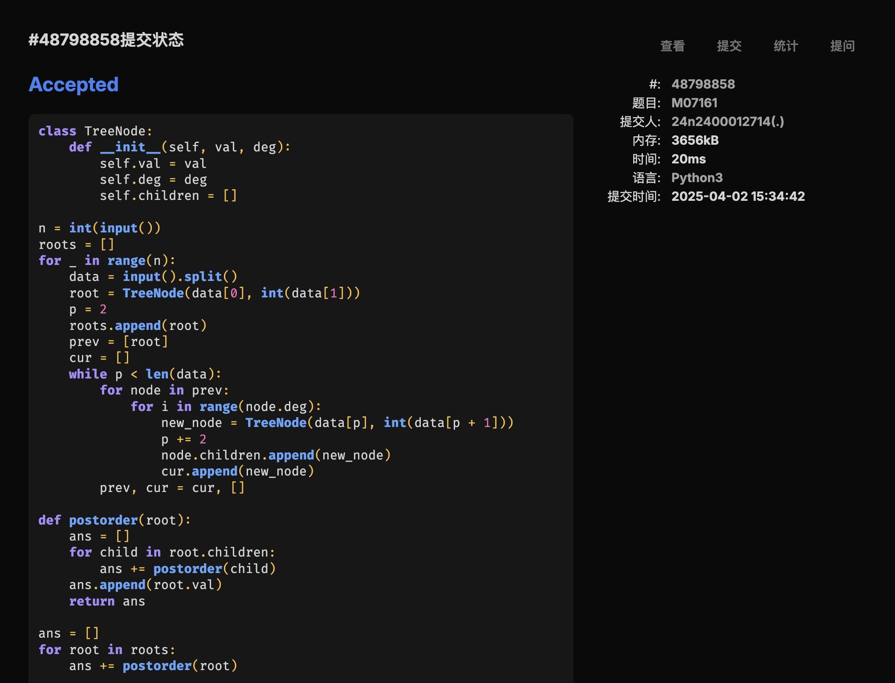
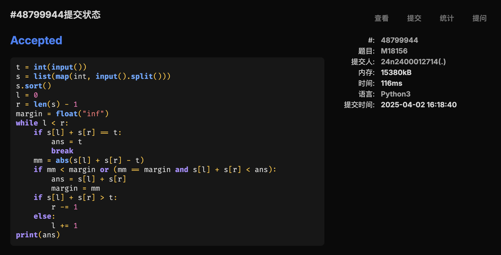
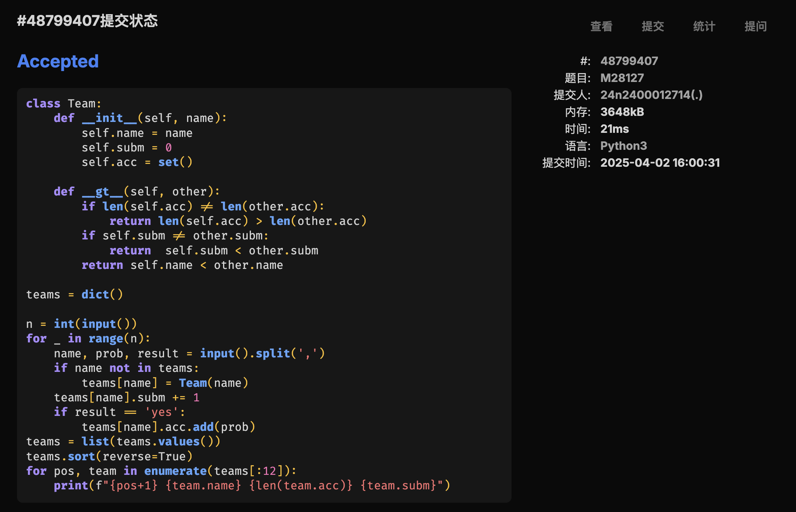

# Assignment #7: 20250402 Mock Exam


## 1. 题目

### [E05344: 最后的最后](http://cs101.openjudge.cn/practice/05344/)

> 你说用链表就用链表吗🤣

#### 代码

```python
from collections import deque

n, k = map(int, input().split())
nums = deque([i for i in range(1, n + 1)])
ans = []
while nums:
    nums.rotate(-k)
    ans.append(nums.pop())
print(*ans[:-1])
```

#### 代码运行截图



### [M02774: 木材加工](http://cs101.openjudge.cn/practice/02774/)

> 奶牛、农夫、伐木工。

#### 代码

```python
n, k = map(int, input().split())
wood = [int(input()) for _ in range(n)]
tot = sum(wood)
if tot < k:
    print(0)
    exit(0)
l = 0
r = tot // k + 1
def validate(piece):
    if sum(map(lambda x: x // piece, wood)) >= k:
        return True
    return False
while l < r - 1:
    mid = (l + r + 1) // 2
    if validate(mid):
        l = mid
    else:
        r = mid
print(l)
```

#### 代码运行截图



### [M07161: 森林的带度数层次序列存储](http://cs101.openjudge.cn/practice/07161/)

#### 代码

```python
class TreeNode:
    def __init__(self, val, deg):
        self.val = val
        self.deg = deg
        self.children = []

n = int(input())
roots = []
for _ in range(n):
    data = input().split()
    root = TreeNode(data[0], int(data[1]))
    p = 2
    roots.append(root)
    prev = [root]
    cur = []
    while p < len(data):
        for node in prev:
            for i in range(node.deg):
                new_node = TreeNode(data[p], int(data[p + 1]))
                p += 2
                node.children.append(new_node)
                cur.append(new_node)
        prev, cur = cur, []

def postorder(root):
    ans = []
    for child in root.children:
        ans += postorder(child)
    ans.append(root.val)
    return ans

ans = []
for root in roots:
    ans += postorder(root)

print(*ans)
```

#### 代码运行截图



### [M18156: 寻找离目标数最近的两数之和](http://cs101.openjudge.cn/practice/18156/)

> 不会证明这个算法的合理性。

#### 代码

```python
t = int(input())
s = list(map(int, input().split()))
s.sort()
l = 0
r = len(s) - 1
margin = float("inf")
while l < r:
    if s[l] + s[r] == t:
        ans = t
        break
    mm = abs(s[l] + s[r] - t)
    if mm < margin or (mm == margin and s[l] + s[r] < ans):
        ans = s[l] + s[r]
        margin = mm
    if s[l] + s[r] > t:
        r -= 1
    else:
        l += 1
print(ans)
```

#### 代码运行截图



### [M18159: 个位为 1 的质数个数](http://cs101.openjudge.cn/practice/18159/)

#### 代码

```python
nums = [True] * 10010
for i in range(2, 5010):
    if not nums[i]:
        continue
    p = i * 2
    while p <= 10001:
        nums[p] = False
        p += i

for case in range(int(input())):
    n = int(input())
    ans = []
    p = 11
    while p < n:
        if nums[p]:
            ans.append(p)
        p += 10
    print(f"Case{case+1}:")
    if ans: print(*ans)
    else: print("NULL")
```

#### 代码运行截图


### [M28127: 北大夺冠](http://cs101.openjudge.cn/practice/28127/)

> OOP!

#### 代码

```python
class Team:
    def __init__(self, name):
        self.name = name
        self.subm = 0
        self.acc = set()

    def __gt__(self, other):
        if len(self.acc) != len(other.acc):
            return len(self.acc) > len(other.acc)
        if self.subm != other.subm:
            return  self.subm < other.subm
        return self.name < other.name

teams = dict()

n = int(input())
for _ in range(n):
    name, prob, result = input().split(',')
    if name not in teams:
        teams[name] = Team(name)
    teams[name].subm += 1
    if result == 'yes':
        teams[name].acc.add(prob)
teams = list(teams.values())
teams.sort(reverse=True)
for pos, team in enumerate(teams[:12]):
    print(f"{pos+1} {team.name} {len(team.acc)} {team.subm}")
```

#### 代码运行截图



## 2. 学习总结和收获

月考比力扣的比赛简单多了😭

上周的双周赛和周赛根本不是人打的😭没有人类了😭

双周赛只会签到题，周赛拼尽全力做出来两道😭
