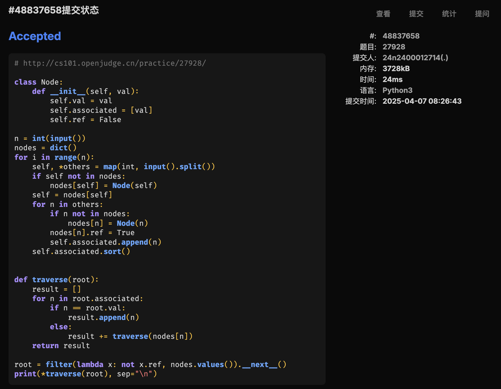
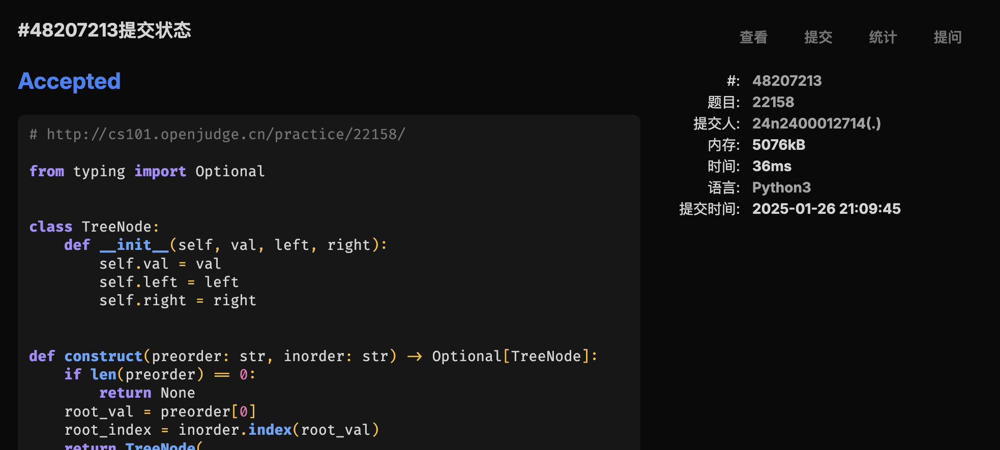
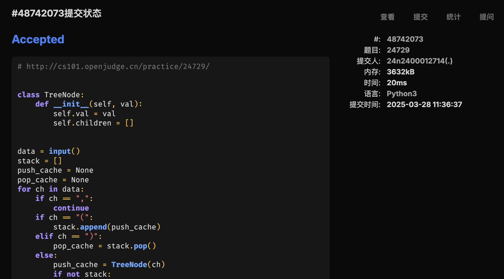

# Assignment #8: 树为主


## 1. 题目

### [LC108. 将有序数组转换为二叉树](https://leetcode.cn/problems/convert-sorted-array-to-binary-search-tree/)

> BST，怎么建，都 AC
>
> OJ 什么时候能引入这样高端的测评方法...

#### 代码

```python
class Solution:
    def sortedArrayToBST(self, nums: List[int]) -> Optional[TreeNode]:
        l = len(nums)
        if l == 0:
            return None
        mid = l // 2
        return TreeNode(
            nums[mid],
            self.sortedArrayToBST(nums[:mid]),
            self.sortedArrayToBST(nums[mid + 1 :]),
        )
```

#### 代码运行截图


### [M27928. 遍历树](http://cs101.openjudge.cn/practice/27928/)

#### 代码

```python
class Node:
    def __init__(self, val):
        self.val = val
        self.associated = [val]
        self.ref = False

n = int(input())
nodes = dict()
for i in range(n):
    self, *others = map(int, input().split())
    if self not in nodes:
        nodes[self] = Node(self)
    self = nodes[self]
    for n in others:
        if n not in nodes:
            nodes[n] = Node(n)
        nodes[n].ref = True
        self.associated.append(n)
    self.associated.sort()


def traverse(root):
    result = []
    for n in root.associated:
        if n == root.val:
            result.append(n)
        else:
            result += traverse(nodes[n])
    return result

root = filter(lambda x: not x.ref, nodes.values()).__next__()
print(*traverse(root), sep="\n")
```

#### 代码运行截图



### [LC129. 求根节点到叶节点数字之和](https://leetcode.cn/problems/sum-root-to-leaf-numbers/)

#### 代码

```python
# https://leetcode.cn/problems/sum-root-to-leaf-numbers/

from typing import Optional, List


# Definition for a binary tree node.
class TreeNode:
    def __init__(self, val=0, left=None, right=None):
        self.val = val
        self.left = left
        self.right = right


class Solution:
    def sumNumbers(self, root: Optional[TreeNode]) -> int:
        if not root:
            return 0

        def get_numbers(current: int, root: Optional[TreeNode]) -> List[int]:
            if not root:
                return []
            current = current * 10 + root.val
            return (
                [current]
                if not root.left and not root.right
                else get_numbers(current, root.left) + get_numbers(current, root.right)
            )

        return sum(get_numbers(0, root))
```

#### 代码运行截图


### [M22158. 根据二叉树前中序序列建树](http://cs101.openjudge.cn/practice/22158/)

#### 代码

```python
from typing import Optional


class TreeNode:
    def __init__(self, val, left, right):
        self.val = val
        self.left = left
        self.right = right


def construct(preorder: str, inorder: str) -> Optional[TreeNode]:
    if len(preorder) == 0:
        return None
    root_val = preorder[0]
    root_index = inorder.index(root_val)
    return TreeNode(
        root_val,
        construct(preorder[1 : root_index + 1], inorder[:root_index]),
        construct(preorder[root_index + 1 :], inorder[root_index + 1 :]),
    )

def postorder(root: Optional[TreeNode]) -> str:
    if root == None: return ""
    return f"{postorder(root.left)}{postorder(root.right)}{root.val}"

while True:
    try:
        preorder = input()
        inorder = input()
    except:
        break
    print(postorder(construct(preorder, inorder)))
```

#### 代码运行截图



### [T24729. 括号嵌套树](http://cs101.openjudge.cn/practice/24729/)

> 好麻烦的输入...

#### 代码

```python
class TreeNode:
    def __init__(self, val):
        self.val = val
        self.children = []


data = input()
stack = []
push_cache = None
pop_cache = None
for ch in data:
    if ch == ",":
        continue
    if ch == "(":
        stack.append(push_cache)
    elif ch == ")":
        pop_cache = stack.pop()
    else:
        push_cache = TreeNode(ch)
        if not stack:
            continue
        stack[-1].children.append(push_cache)
root = pop_cache if pop_cache else push_cache


def preorder(root):
    return (
        ""
        if not root
        else f"{root.val}{''.join([preorder(child) for child in root.children])}"
    )


def postorder(root):
    return (
        ""
        if not root
        else f"{''.join([postorder(child) for child in root.children])}{root.val}"
    )

print(preorder(root))
print(postorder(root))
```

#### 代码运行截图



### [LC3510. 移除最小数对使数组有序II](https://leetcode.cn/problems/minimum-pair-removal-to-sort-array-ii/)

> 堆什么的倒是比较好想，但是确实不知道怎么高效检查数组有序
>
> 维护 rev 是看题解看到的方法，也比较好实现，就直接拿周赛的超时代码改了
>
> 这道数据量巨大的题目用 `__slots__` 能节省 20 MB 内存，貌似还能提高运行速度
>
> 

#### 代码

```python
from typing import List
import heapq


class Node:
    __slots__ = ["val", "pos", "prev", "next", "dropped"]

    def __init__(self, val, pos):
        self.val = val
        self.pos = pos
        self.prev = None
        self.next = None
        self.dropped = False


class OrderingNode:
    __slots__ = ["val", "pos", "l", "r"]

    def __init__(self, l: Node, r: Node):
        self.val = l.val + r.val
        self.pos = l.pos
        self.l = l
        self.r = r

    def __lt__(self, other):
        if self.val != other.val:
            return self.val < other.val
        return self.pos < other.pos


class Solution:
    def minimumPairRemoval(self, nums: List[int]) -> int:
        nodes = []
        for i in range(len(nums)):
            nn = Node(nums[i], i)
            if nodes:
                nodes[-1].next = nn
                nn.prev = nodes[-1]
            nodes.append(nn)

        # count the reversed, so we dont need to validate the entire array
        # over and over again.
        revs = sum([1 if nums[i] < nums[i - 1] else 0 for i in range(1, len(nums))])
        pq: List[OrderingNode] = []
        for i in range(len(nums) - 1):
            pq.append(OrderingNode(nodes[i], nodes[i + 1]))
        heapq.heapify(pq)
        ops = 0

        while pq and revs:
            ordn = heapq.heappop(pq)
            while pq and ordn.l.dropped or ordn.r.dropped:
                ordn = heapq.heappop(pq)
            if ordn.l.dropped or ordn.r.dropped:
                break
            ops += 1
            ordn.l.dropped = True
            ordn.r.dropped = True
            nn = Node(ordn.val, ordn.pos)
            nn.prev = ordn.l.prev
            nn.next = ordn.r.next
            lv = ordn.l.val
            rv = ordn.r.val

            # update the revs count.
            # only 3 parts could possibly lead to the change
            # prev  pair_left  pair_right  next
            #     ^^         ^^          ^^
            # sum is not guaranteed to increase as nums could be negative.
            if lv > rv:
                revs -= 1
            sv = lv + rv
            if ordn.l.prev:
                pv = ordn.l.prev.val
                if pv > lv and pv <= sv:
                    revs -= 1
                if pv <= lv and pv > sv:
                    revs += 1
            if ordn.r.next:
                nv = ordn.r.next.val
                if rv > nv and sv <= nv:
                    revs -= 1
                if rv <= nv and sv > nv:
                    revs += 1

            if nn.prev:
                nn.prev.next = nn
                heapq.heappush(pq, OrderingNode(nn.prev, nn))
            if nn.next:
                nn.next.prev = nn
                heapq.heappush(pq, OrderingNode(nn, nn.next))
        return ops
```

#### 代码运行截图


## 2. 学习总结和收获

周赛拼尽全力 AC 2。仍需努力。