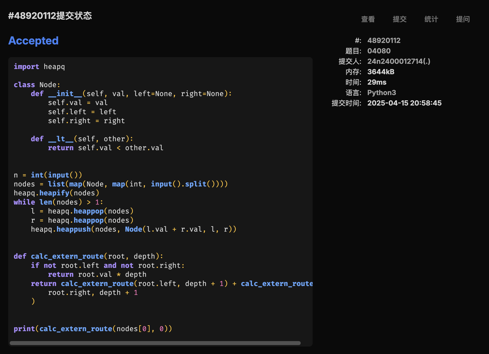
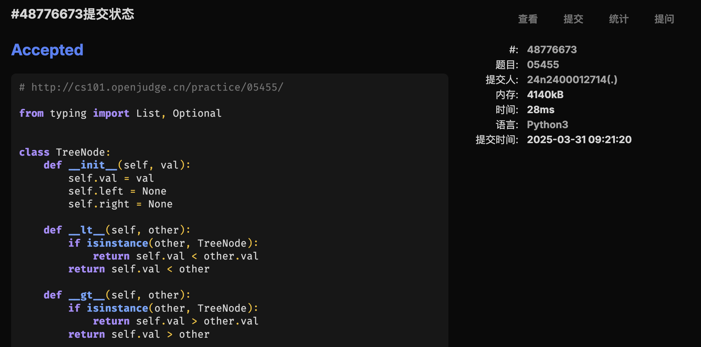
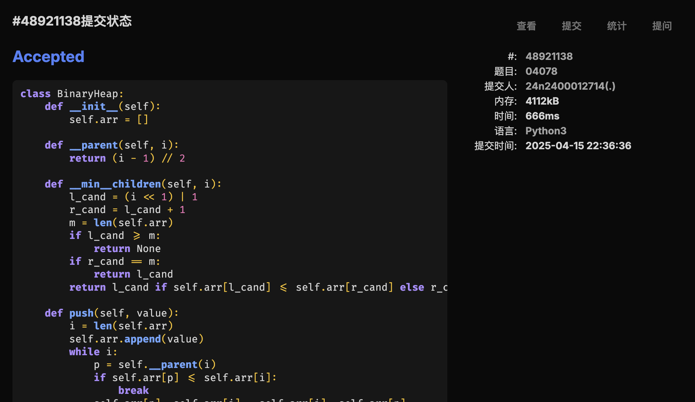
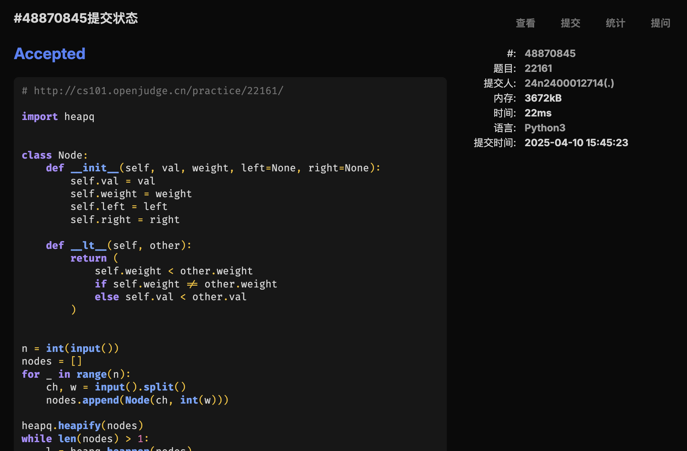

# Assignment #9: Huffman, BST & Heap


## 1. 题目

### [LC222. 完全二叉树的节点个数](https://leetcode.cn/problems/count-complete-tree-nodes/)

#### 思路

官方题解有点过于神秘了，参考了另外一个题解。

基本思路是判断二叉树是不是满二叉树，如果是就直接返回节点个数，如果不是再看两颗子树。

#### 代码

```python
class Solution:
    def countNodes(self, root: Optional[TreeNode]) -> int:
        def do_count(root):
            if not root:
                return 0
            lp = 0
            rp = 0
            p = root
            while p:
                lp += 1
                p = p.left
            p = root
            while p:
                rp += 1
                p = p.right
            if lp == rp:
                return (1 << lp) - 1
            return do_count(root.left) + do_count(root.right) + 1
        return do_count(root)
```

#### 代码运行截图


### [LC103. 二叉树的锯齿形层序遍历](https://leetcode.cn/problems/binary-tree-zigzag-level-order-traversal/)

#### 代码

```python
class Solution:
    def zigzagLevelOrder(self, root: Optional[TreeNode]) -> List[List[int]]:
        if not root:
            return []
        result = []
        current_level = [root]
        while current_level:
            current_level_result = []
            next_level = []
            for node in current_level:
                current_level_result.append(node.val)
                if node.left:
                    next_level.append(node.left)
                if node.right:
                    next_level.append(node.right)
            result.append(current_level_result)
            current_level = next_level
        for i in range(1, len(result), 2):
            result[i].reverse()
        return result
```

还有一份一时兴起的用 Rust 的版本：

```rs
use std::cell::RefCell;
use std::rc::Rc;
impl Solution {
    pub fn zigzag_level_order(root: Option<Rc<RefCell<TreeNode>>>) -> Vec<Vec<i32>> {
        if root.is_none() {
            return vec![];
        }
        let root = root.unwrap();
        let mut current_level = vec![root];
        let mut next_level = vec![];
        let mut result = vec![];
        let mut level_result = vec![];
        while current_level.len() > 0 {
            for node in current_level {
                level_result.push(node.borrow().val);
                if node.borrow().left.is_some() {
                    next_level.push(node.borrow().left.as_ref().unwrap().clone());
                }
                if node.borrow().right.is_some() {
                    next_level.push(node.borrow().right.as_ref().unwrap().clone());
                }
            }
            result.push(level_result);
            level_result = vec![];
            current_level = next_level;
            next_level = vec![];
        }
        for level in result.iter_mut().skip(1).step_by(2) {
            level.reverse();
        }
        return result;
    }
}
```

#### 代码运行截图

**Python**


**Rust**


### [M04080. Huffman编码树](http://cs101.openjudge.cn/practice/04080/)

#### 代码

```python
import heapq

class Node:
    def __init__(self, val, left=None, right=None):
        self.val = val
        self.left = left
        self.right = right

    def __lt__(self, other):
        return self.val < other.val


n = int(input())
nodes = list(map(Node, map(int, input().split())))
heapq.heapify(nodes)
while len(nodes) > 1:
    l = heapq.heappop(nodes)
    r = heapq.heappop(nodes)
    heapq.heappush(nodes, Node(l.val + r.val, l, r))


def calc_extern_route(root, depth):
    if not root.left and not root.right:
        return root.val * depth
    return calc_extern_route(root.left, depth + 1) + calc_extern_route(
        root.right, depth + 1
    )


print(calc_extern_route(nodes[0], 0))
```

#### 代码运行截图



### [M05455. 二叉搜索树的层次遍历](http://cs101.openjudge.cn/practice/05455/)

#### 代码

```python
from typing import List, Optional


class TreeNode:
    def __init__(self, val):
        self.val = val
        self.left = None
        self.right = None

    def __lt__(self, other):
        if isinstance(other, TreeNode):
            return self.val < other.val
        return self.val < other

    def __gt__(self, other):
        if isinstance(other, TreeNode):
            return self.val > other.val
        return self.val > other

    def __eq__(self, other):
        if isinstance(other, TreeNode):
            return self.val == other.val
        return self.val == other


def construct(data: List):
    root = None
    for n in data:
        if not root:
            root = TreeNode(n)
            continue
        p = root
        while True:
            if n == p:
                break
            if n < p:
                if not p.left:
                    p.left = TreeNode(n)
                    break
                p = p.left
            else:
                if not p.right:
                    p.right = TreeNode(n)
                    break
                p = p.right
    return root


def level_order_traversal(root: Optional[TreeNode]):
    if not root:
        return []
    result = []
    pending = [root]
    while pending:
        next_level = []
        for node in pending:
            result.append(node.val)
            if node.left:
                next_level.append(node.left)
            if node.right:
                next_level.append(node.right)
        pending = next_level
    return result


arr = map(int, input().split())
print(*level_order_traversal(construct(arr)))
```

#### 代码运行截图



### [M04078. 实现堆结构](http://cs101.openjudge.cn/practice/04078/)

#### 思路

> 君子生非异也，善假于物也。

思路很简单，但是实现上面有很多细节要注意。

第一次就因为没有选择最小的子元素错了。

为什么 `heapq` 的实现会比自己实现快将近一倍？是内部做了特殊的优化吗？

#### 代码

```python
class BinaryHeap:
    def __init__(self):
        self.arr = []

    def __parent(self, i):
        return (i - 1) // 2

    def __min__children(self, i):
        l_cand = (i << 1) | 1
        r_cand = l_cand + 1
        m = len(self.arr)
        if l_cand >= m:
            return None
        if r_cand == m:
            return l_cand
        return l_cand if self.arr[l_cand] <= self.arr[r_cand] else r_cand

    def push(self, value):
        i = len(self.arr)
        self.arr.append(value)
        while i:
            p = self.__parent(i)
            if self.arr[p] <= self.arr[i]:
                break
            self.arr[p], self.arr[i] = self.arr[i], self.arr[p]
            i = p

    def pop(self):
        if not self.arr:
            raise IndexError
        if len(self.arr) == 1:
            return self.arr.pop()
        ret = self.arr[0]
        self.arr[0] = self.arr.pop()
        i = 0
        min_ch = self.__min__children(i)
        while min_ch:
            if self.arr[min_ch] >= self.arr[i]:
                break
            self.arr[min_ch], self.arr[i] = self.arr[i], self.arr[min_ch]
            i = min_ch
            min_ch = self.__min__children(i)
        return ret


ops = int(input())
heap = BinaryHeap()

for _ in range(ops):
    op, *args = map(int, input().split())
    if op == 1:
        heap.push(args[0])
    else:
        print(heap.pop())
```

#### 代码运行截图



### [T22161. 哈夫曼编码树](http://cs101.openjudge.cn/practice/22161/)

#### 代码

```python
import heapq


class Node:
    def __init__(self, val, weight, left=None, right=None):
        self.val = val
        self.weight = weight
        self.left = left
        self.right = right

    def __lt__(self, other):
        return (
            self.weight < other.weight
            if self.weight != other.weight
            else self.val < other.val
        )


n = int(input())
nodes = []
for _ in range(n):
    ch, w = input().split()
    nodes.append(Node(ch, int(w)))

heapq.heapify(nodes)
while len(nodes) > 1:
    l = heapq.heappop(nodes)
    r = heapq.heappop(nodes)
    heapq.heappush(nodes, Node(min(l.val, r.val), l.weight + r.weight, l, r))

root = nodes[0]

char_bin_map = dict()


def build_map(root, encoding):
    if not root.left and not root.right:
        char_bin_map[root.val] = encoding
        return
    if root.left:
        build_map(root.left, encoding + "0")
    if root.right:
        build_map(root.right, encoding + "1")


build_map(root, "")

while True:
    try:
        data = input()
    except:
        break
    if not data:
        break
    if data.isalpha():
        for ch in data:
            print(char_bin_map[ch], end="")
        print()
    else:
        p = root
        ans = []
        for ch in data:
            p = p.left if ch == "0" else p.right
            if not p.left and not p.right:
                ans.append(p.val)
                p = root
        print(*ans, sep="")
```

#### 代码运行截图



## 2. 学习总结和收获

持续跟进每日选做，上周因为准备高数考试没有参加力扣的比赛。
