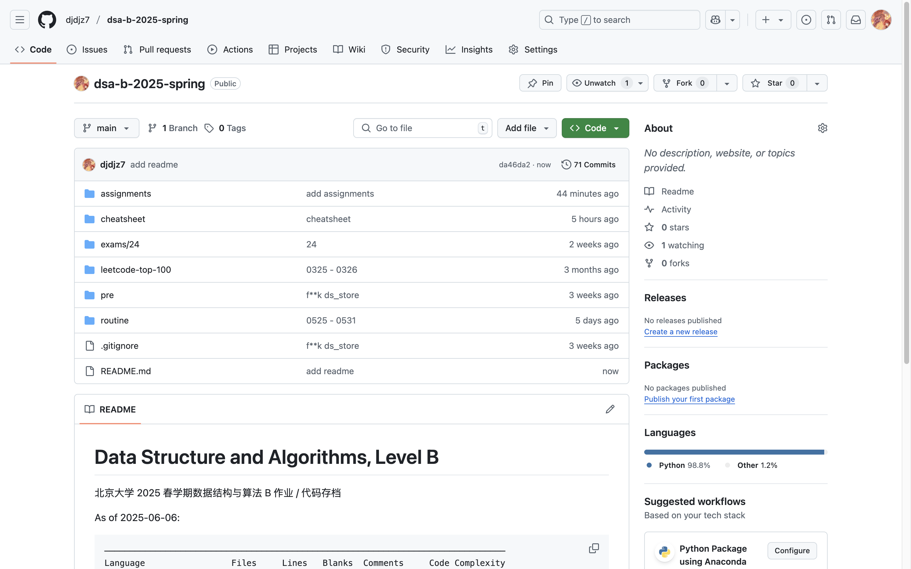

# Assignment #P: 课程大作业


https://github.com/djdjz7/dsa-b-2025-spring



## 课程总结

```plaintext
───────────────────────────────────────────────────────────────────────────────
Language                 Files     Lines   Blanks  Comments     Code Complexity
───────────────────────────────────────────────────────────────────────────────
Python                     361     10356     1727       497     8132       2431
Markdown                    16      4537      994         0     3543          0
Rust                         2        74        4         2       68         10
C++                          1        60        3         1       56         10
───────────────────────────────────────────────────────────────────────────────
Total                      380     15027     2728       500    11799       2451
───────────────────────────────────────────────────────────────────────────────
Estimated Cost to Develop (organic) $360,605
Estimated Schedule Effort (organic) 9.33 months
Estimated People Required (organic) 3.43
───────────────────────────────────────────────────────────────────────────────
Processed 393895 bytes, 0.394 megabytes (SI)
───────────────────────────────────────────────────────────────────────────────
```

一个学期下来累计写了一万多行代码😎，比较可惜的是没有能够完成力扣热题 100

之前有非常浅层的 oi 经历（刚刚学了一点算法但是一场比赛都没打过的那种），一直感觉图论这种东西好高深，现在发现并非如此，一些入门的算法还是比较好理解的

机考有幸能够 AK，可能是因为题目风格比较对胃口，说实话比起应用，我并不是很擅长算法部分，备选的两道题其实不能很好的写出来

大模型有关的内容也很有趣，暑假看看有没有时间能把 Build a LLM from Scratch 看完

闫老师非常尽心尽责，在课程群里问问题都能得到及时的回复，非常感谢闫老师和各位助教的辛勤付出还有群内同学的帮助

持续吐槽 openjudge 什么时候能公开测试数据，不然样例过了但是测试点不过的程序真的太难调试了😭（明明编程网格平时作业都能显示错误的测试点数据的🏳️）